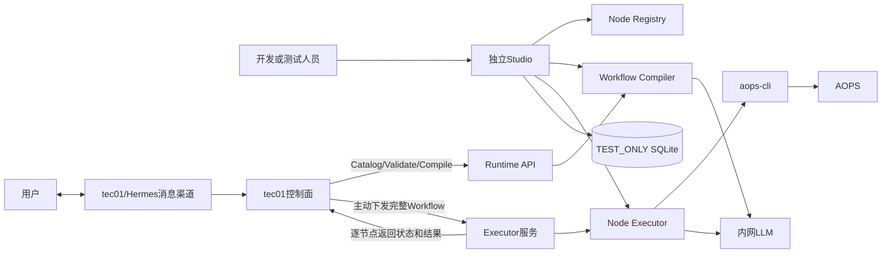

# 精简后架构

## 边界

itsm-workflow拥有节点定义、草稿编译、DAG校验、计划渲染、节点Handler和外部系统适配器。tec01拥有生产知识、MCP、权限、状态机、队列、Artifact、Checkpoint和审计。

## 保留模块

| 模块 | 路径 | 职责 |
|---|---|---|
| Node Registry | `app/runtime/registry.py`、`builtin_nodes.py` | 节点Manifest、Schema、版本与能力目录 |
| Node Executor | `app/runtime/executor.py` | 单节点统一执行入口，Studio和后续Remote Executor共用 |
| Compiler | `app/extraction.py` | 审计过滤、SQL参数化、LLM中文提炼、DAG生成 |
| Planner | `app/runtime/planner.py` | DAG归一化、校验、计划材料和内容哈希 |
| CLI Adapter | `app/cli.py` | 安全argv执行、SSE解析、超时、限流和诊断脱敏 |
| tec01 Adapter | `app/tec01_client.py` | 接收tec01调度、逐节点状态回写和控制命令 |
| Studio | `app/studio`、`frontend` | TEST_ONLY编排和调试 |

## 已移除模块

本仓库不再包含本地生产知识、全文/向量检索、MCP Server、AOPS生产用户登录与业务权限、生产运行中心、PostgreSQL模型、Alembic迁移、旧生产Worker、导入导出和生产Artifact存储。独立Studio仅使用`STUDIO_ADMIN_TOKEN`保护本地Node管理和调试页面。

SQLite仅保存临时workspace与调试输出，默认24小时清理；它不是tec01的副本，也不能承载生产恢复。

草稿提取由tec01主动提交工单数据，Compiler分阶段回调进度。生产执行由tec01主动下发完整Workflow；Executor根据tec01给出的节点状态继续执行，并逐节点返回状态和结果。tec01同时负责Web页面、Hermes消息渠道和MCP，三个入口共享同一运行状态。
