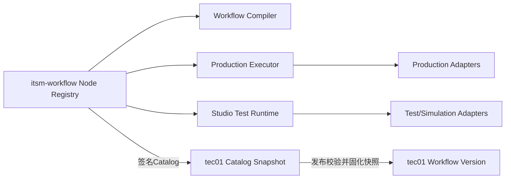
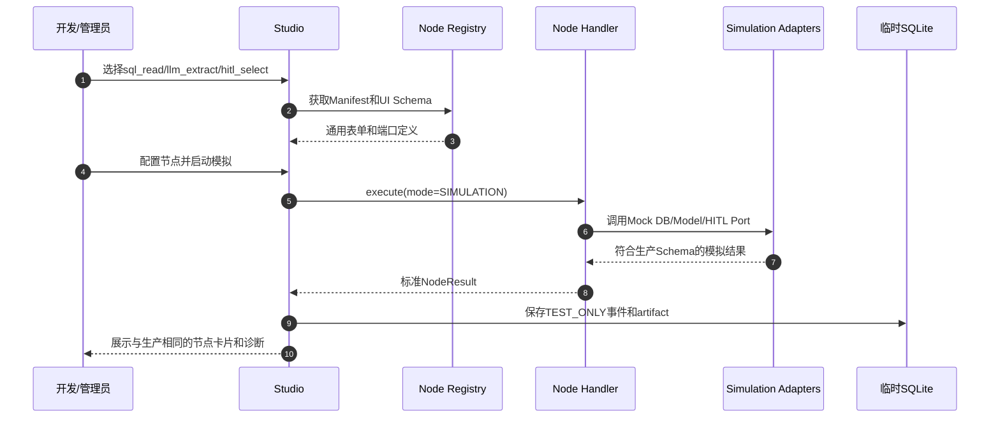
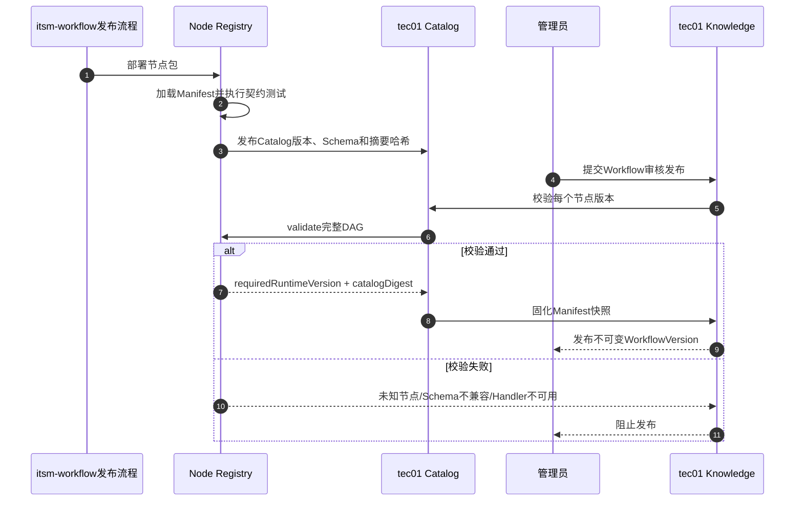

# 统一Node Registry与节点扩展设计

## 设计结论

以下能力全部是Node Registry管理的节点类型：

```text
sql_read
condition
llm_extract
hitl_select
human_input
approval
end
未来新增的其他生产操作节点
```

“LLM模拟”“HITL模拟”“SQL模拟”不是新的节点类型，而是同一个节点Handler在不同执行模式下使用不同基础设施Adapter：

```text
PRODUCTION  生产执行
TEST        连接测试环境执行
SIMULATION  使用固定样例或Mock Adapter
DRY_RUN     只校验和渲染计划，不产生外部调用
```

Workflow Compiler、生产Executor和Studio必须消费同一个Node Registry，避免分别维护节点Schema、参数规则和运行语义。

需要区分两个阶段：Compiler为了“生成草稿”而调用LLM属于编译器内部处理，此时工作流尚不存在，所以它不是DAG节点；草稿或生产工作流中出现的LLM分析必须表示为正式`llm_extract`节点，并由Registry管理。HITL、SQL读和条件判断只要出现在DAG中，也全部是正式节点。

## Node Registry在架构中的位置



Registry是节点定义和执行实现的源。tec01不重新定义节点，只保存用于生产治理和历史复现的Catalog快照。

## 节点包结构

每个节点由Manifest、Schema、Handler、计划渲染器和测试资产组成：

```text
nodes/
  sql_read/
    manifest.yaml
    config.schema.json
    input.schema.json
    output.schema.json
    ui.schema.json
    handler.py
    planner.py
    fixtures/
  llm_extract/
  hitl_select/
  condition/
```

节点代码必须随itsm-workflow发布，不允许从数据库、知识定义或导入包加载任意Python代码。

## Node Manifest

统一Manifest建议如下：

```yaml
type: llm_extract
schemaVersion: 1
handlerVersion: 1.0.0
display:
  name: LLM结构化提取
  category: transform
  description: 将前置节点结果格式化为符合JSON Schema的结构化候选
riskLevel: LOW
approvalPolicy: PLAN
idempotencyClass: REPLAY_WITH_STORED_RESULT
resumeSemantics: CHECK_RESULT_THEN_RETRY
supportedModes:
  - PRODUCTION
  - TEST
  - SIMULATION
  - DRY_RUN
configSchema: config.schema.json
inputSchema: input.schema.json
outputSchema: output.schema.json
uiSchema: ui.schema.json
resultSensitivity: BUSINESS_DATA
handler: nodes.llm_extract.handler:LlmExtractHandler
planner: nodes.llm_extract.planner:LlmExtractPlanner
```

字段含义：

| 字段 | 作用 |
|---|---|
| `type` | DAG中稳定的节点类型标识 |
| `schemaVersion` | 持久化配置和输入输出协议版本 |
| `handlerVersion` | 执行实现版本，写入计划、attempt和审计 |
| `display` | Studio和tec01通用卡片需要的名称、分类和说明 |
| `riskLevel` | 风险策略和审批下限 |
| `idempotencyClass` | 是否可安全重放、需复用结果或不可自动重试 |
| `resumeSemantics` | Worker丢失后的恢复或UNKNOWN规则 |
| `supportedModes` | 节点允许在哪些执行上下文运行 |
| Schema字段 | 配置、输入、输出和通用表单渲染协议 |
| `resultSensitivity` | artifact脱敏、权限和保留策略 |

## 节点Handler接口

所有节点实现同一生命周期：

```python
class NodeHandler(Protocol):
    def validate(self, definition, catalog_context): ...
    def plan(self, definition, resolved_inputs, context): ...
    async def execute(self, prepared, ports, context): ...
    async def resume(self, checkpoint, resume_payload, ports, context): ...
    async def cancel(self, execution_handle, ports, context): ...
    async def reconcile(self, started_attempt, ports, context): ...
    def summarize(self, result): ...
```

Handler不直接访问tec01、SQLite、模型HTTP或`aops-cli`路径，而是依赖标准Port：

```text
StatePort
ArtifactPort
CredentialPort
AopsDbReadPort
ModelPort
HumanInteractionPort
EventPort
ClockPort
```

执行环境负责注入具体Adapter。

## 执行模式与Adapter

| Port | PRODUCTION | TEST | SIMULATION | DRY_RUN |
|---|---|---|---|---|
| `StatePort` | tec01运行状态/租约/checkpoint | Studio SQLite | Studio SQLite | 不保存或只存计划 |
| `ArtifactPort` | tec01加密artifact | SQLite临时artifact | SQLite固定样例 | 不产生业务artifact |
| `CredentialPort` | tec01短期凭据Broker | 测试环境凭据 | 禁止真实凭据 | 禁止凭据 |
| `AopsDbReadPort` | 系统`aops-cli`生产地址 | 测试AOPS/测试库 | FixtureDbReadAdapter | 只渲染命令 |
| `ModelPort` | 批准的内网模型配置 | 测试模型Profile | FixtureModelAdapter | 只校验Prompt和Schema |
| `HumanInteractionPort` | tec01持久化interrupt + Channel | Studio测试interrupt | Studio本地候选选择 | 只展示可能的interrupt |

因此Studio所谓的“LLM/HITL/SQL模拟”是节点真实Handler在`SIMULATION`上下文运行，而不是另一套模拟节点代码。

## 内置节点定义

### `sql_read`

- 配置：`databaseRef`、`sqlTemplate`、超时和最大行数。
- 输入：运行参数、字面量或前置节点JSON Pointer。
- 输出：`data[]`、列定义、行数和SSE元数据。
- 生产Adapter调用`aops-cli db read`；模拟Adapter返回符合相同输出Schema的Fixture。
- `idempotencyClass=READ_SAFE`，但为避免重复AOPS审计，FAILED/UNKNOWN仍要求人工确认重试。

### `condition`

- 配置：受限JSON Pointer规则和默认边。
- 不调用外部系统，所有模式执行相同确定性逻辑。
- 输出：命中边、规则摘要和SKIPPED集合。
- 禁止由LLM直接决定路由。

### `llm_extract`

- 配置：批准的`modelProfile`、`promptTemplateId`、`responseSchema`、输入限制和数据策略。
- 输入：前置artifact的受限投影。
- 输出：通过Schema校验的结构化对象，例如`candidates[]`。
- 生产Adapter调用tec01 Model Gateway；模拟Adapter读取固定响应Fixture。
- 使用`runId + nodeId + inputHash + promptVersion`做幂等，保存响应后重试必须复用。

### `hitl_select`

- 输入：候选数组。
- 0个候选：按策略请求手工输入或失败。
- 1个候选：自动选择并记录事件。
- 多个候选：通过`HumanInteractionPort`创建持久化interrupt。
- 生产Adapter把interrupt写tec01并通过Channel交互；Studio Adapter在本地页面展示相同选择卡片。

### `human_input`

- 用于没有预定义候选的人工补参。
- 必须声明字段Schema、说明、是否敏感和校验规则。
- 用户响应经过Schema校验后才成为节点输出。

### `approval`

- 用于高风险节点到达时的二次审批。
- 输出审批决定、审批人、时间和计划哈希。
- 不能由知识配置降低平台规定的最低审批级别。

### `end`

- 汇总运行输出和安全摘要。
- 不执行外部操作。

## Compiler、Executor和Studio如何共用Registry

### Workflow Compiler

- LLM只能从当前Catalog允许的节点类型和Schema中生成DAG。
- 生成后调用Registry完整校验，不能直接拼接未知节点JSON。
- 参数化SQL使用`sql_read`的输入和输出Schema。
- 草稿中需要LLM/HITL时生成正式`llm_extract/hitl_select`节点，而不是嵌入自由提示词步骤。

### Production Executor

- 按工作流版本固化的`type + schemaVersion + handlerVersion`加载Handler。
- 执行前再次校验节点定义和输入。
- 使用生产Ports把状态、artifact、interrupt和checkpoint写入tec01。
- 找不到精确兼容Handler时拒绝领取，不尝试使用最新版猜测执行。

### Studio

- 从Registry生成节点面板、配置表单、输入绑定和结果视图。
- 使用同一Handler，但注入TEST/SIMULATION Ports。
- 保存到SQLite的数据始终标记`TEST_ONLY`。
- 提交到tec01前重新通过Registry执行生产级静态校验。

## 节点测试流程



## Catalog同步与工作流发布



## 版本兼容

- 工作流版本固定`catalogDigest`和每个节点的`schemaVersion`。
- 生产attempt记录实际`handlerVersion`和runtime版本。
- 修复实现但不改变协议时可以提升patch版本，并通过兼容矩阵声明可执行旧版本。
- 行为、输入或输出变化必须增加`schemaVersion`并保留旧Handler，直到相关运行和版本退出保留期。
- `DEPRECATED`节点允许查看和运行已有版本，但不能创建新草稿。
- `DISABLED`只用于存在安全风险的节点；tec01阻止新运行，并明确列出受影响工作流。

## 安全边界

- Registry只加载随软件发布并通过签名/哈希校验的节点包。
- `uiSchema`只能描述通用控件，不能下发任意JavaScript。
- 模型URL、数据库凭据、Authorization Header不能成为节点自由配置字段。
- Studio模拟默认禁止生产凭据和生产数据库路径。
- 节点日志只允许安全摘要；完整结果按artifact敏感级别加密存储。
- Handler不能绕过StatePort直接宣称节点成功。

## 建议实现顺序

1. 从现有`app/node_types.py`提取完整Manifest和Registry接口。
2. 将`sql_read/condition/end`迁入Registry并保持现有行为。
3. 让Compiler和Studio从Registry生成、编辑和校验节点。
4. 引入Port/Adapter层，把tec01生产存储和Studio SQLite隔离。
5. 实现`llm_extract`和`hitl_select`，完成SQL多结果选择场景。
6. 增加节点契约、恢复、取消、幂等和安全测试模板。
7. tec01同步Catalog并在知识发布时固化快照。

## 验收标准

- Compiler、Executor和Studio中不存在重复维护的节点Schema。
- 同一DAG在SIMULATION和PRODUCTION模式下具有相同输入输出结构。
- Studio模拟不会访问生产AOPS、生产模型凭据或生产状态。
- 未注册、版本不兼容或被禁用节点无法发布或执行。
- LLM自然语言响应未通过JSON Schema时节点明确失败。
- HITL等待、用户选择、恢复和重复回复均可从tec01事实恢复。
- 新节点只需实现标准Handler、Manifest、Schema和契约测试，不修改调度核心。
