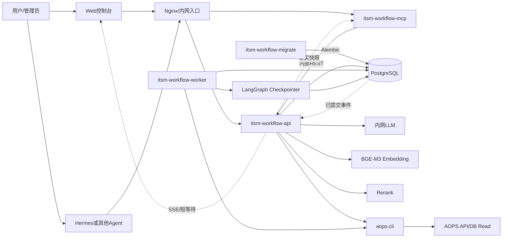
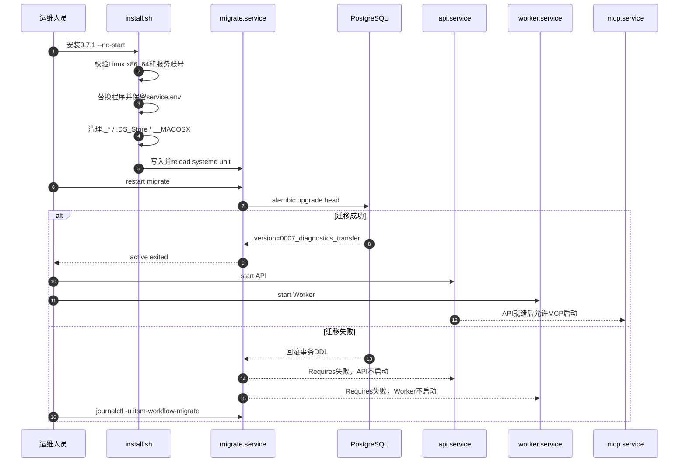
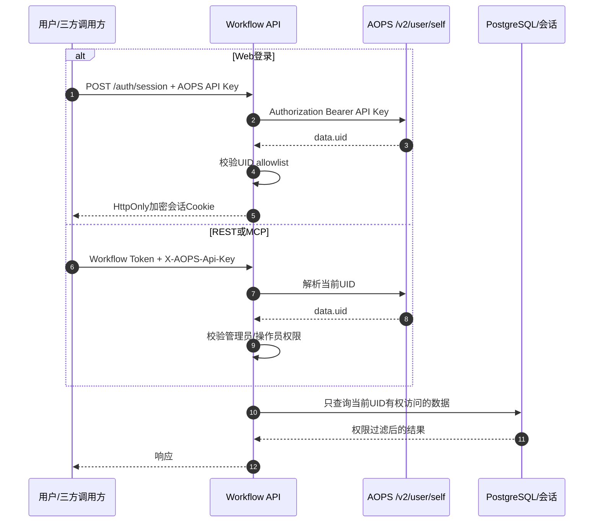
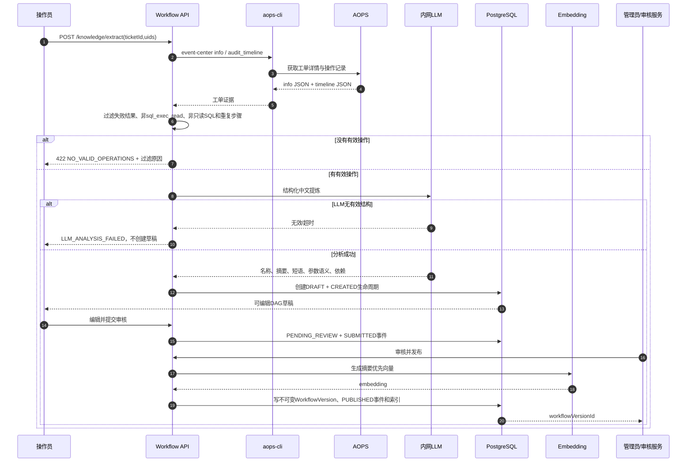
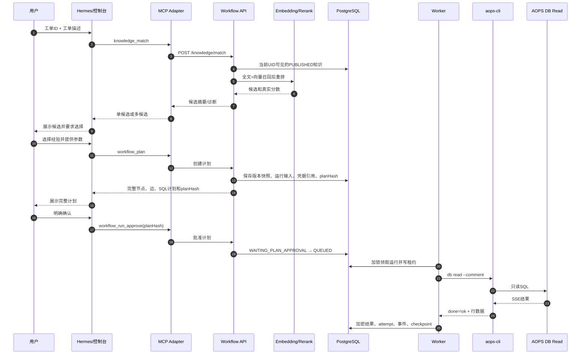
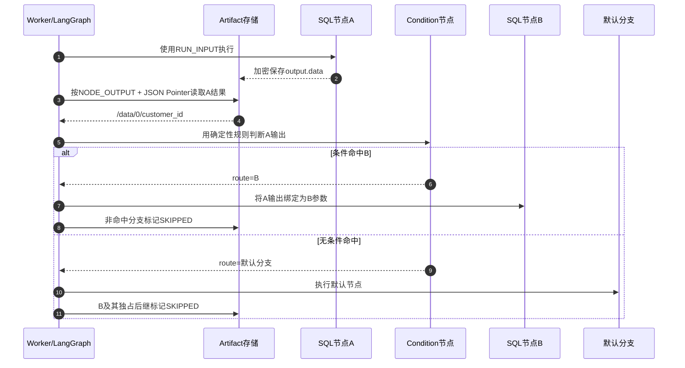
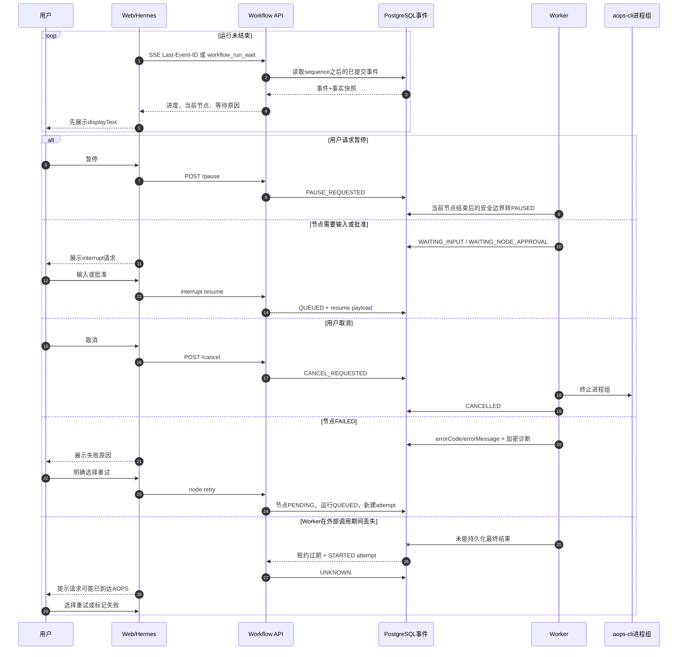
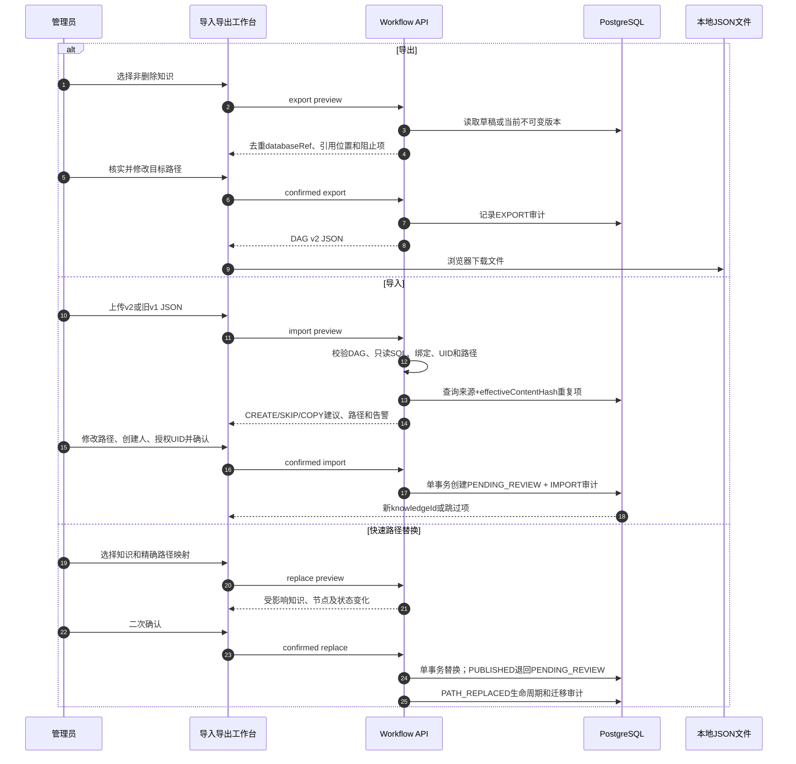
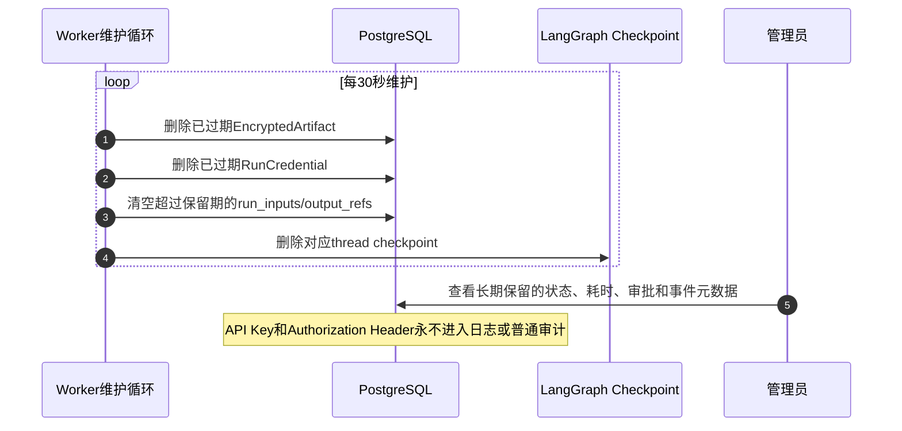

# 服务职责、总体架构与关键流程泳道图

本文面向平台运维、二次开发、工作流设计人员和 Agent接入方。图中的“提交”均表示事务已经写入 PostgreSQL；只有已提交状态才允许 UI、REST或 MCP对外宣称为事实。

## 服务与外部组件职责

| 组件 | 运行形式 | 核心职责 | 持有或访问的数据 | 故障影响 |
|---|---|---|---|---|
| `itsm-workflow-migrate` | systemd oneshot | 启动前执行 Alembic迁移，保证表、列和索引与程序版本一致 | PostgreSQL Schema、`alembic_version` | API和 Worker通过 `Requires`阻止启动，避免新代码访问旧表结构 |
| `itsm-workflow-api` | FastAPI + systemd | 登录鉴权、知识管理、检索匹配、计划创建、审批、中断控制、结果读取、SSE、管理页面和静态资源 | 业务表、加密凭据、加密 artifact；不直接领取运行任务 | 页面、REST和内部 MCP调用不可用；已经运行的 Worker可继续当前节点 |
| `itsm-workflow-worker` | Python常驻进程 + systemd | 领取 `QUEUED`运行、维护租约、驱动 LangGraph、执行节点、调用 `aops-cli`、写 attempt/checkpoint/event、清理过期敏感数据 | 运行、节点尝试、凭据引用、artifact、LangGraph checkpoint | 新运行不执行；外部调用期间丢失 Worker时节点转为 `UNKNOWN`，禁止自动重放 |
| `itsm-workflow-mcp` | Streamable HTTP MCP Adapter + systemd | 把 Agent工具调用转换为内部 REST调用，传递身份头，生成适合 Agent展示的事实摘要 | 不直接访问数据库，不保存 API Key，不执行 CLI | Hermes等 Agent无法调用；Web和REST仍可正常使用 |
| PostgreSQL | 内网基础设施 | 唯一生产持久化源：知识、版本、运行、事件、租约、审批、迁移审计、加密凭据和 checkpoint | 所有生产事实 | 整个平台停止读写；不得降级为生产 SQLite |
| `aops-cli` | 目标机系统可执行文件 | 获取工单证据，执行 `db read`，把用户 AOPS API Key放在子进程环境中 | 仅运行期接收 API Key；不由安装包携带 | 工单提取或 SQL节点失败，平台记录可读诊断 |
| AOPS | 外部内网服务 | 用户身份、工单详情、审计时间线和数据库只读操作 | AOPS业务数据和审计记录 | 登录、草稿提取或节点执行不可用 |
| 内网 LLM | HTTP服务 | 把已过滤的工单证据提炼成中文名称、摘要、匹配短语、参数语义和依赖 | 只接收提取所需的工单语义与安全操作定义 | 不生成低质量兜底草稿，返回 `LLM_ANALYSIS_FAILED` |
| BGE-M3 Embedding | HTTP服务 | 为已发布知识和查询意图生成向量 | 摘要优先检索文本 | 匹配降级为全文召回，禁止可靠自动选择 |
| Rerank | HTTP服务 | 对融合候选重排 | 查询意图与摘要优先文档 | 返回融合排序并要求用户选择 |
| Nginx | 可选反向代理 | TLS、子路径转发、SSE关闭缓冲、MCP路由 | 不持有业务数据 | 配置错误会造成静态资源404、SSE延迟或 MCP不可达 |
| Web控制台 | React静态页面 | 知识编排、计划确认、运行画布、诊断、导入导出和人工中断处理 | 只保存短期页面状态；身份在 HttpOnly会话中 | 不影响后台运行，恢复页面后从数据库和 SSE重建状态 |
| Hermes或其他 Agent | MCP客户端 | 匹配经验、展示计划、获得用户确认、短轮询状态、展示结果和处理中断 | 不应缓存为事实源，不直接调用 `aops-cli` | Agent断开不影响运行；重连后从 `lastEventId`继续观察 |

## 总体架构

核心边界：

- API负责“接收、校验、授权和记录控制意图”，Worker负责“实际执行”。
- MCP只适配协议，不复制业务状态机，不直接访问数据库或 CLI。
- PostgreSQL是唯一事实源；SSE、MCP wait和页面刷新读取的都是已提交状态。
- LangGraph checkpoint恢复图状态，attempt ledger协调外部 CLI调用的非 exactly-once风险。

## 1. 安装、迁移与服务启动

## 2. 登录与请求鉴权

API Key不进入 URL、命令行参数、日志、MCP工具参数或普通响应。

## 3. 从工单提取、审核并发布知识

## 4. 经验匹配、计划确认与执行

Hermes不能跳过计划展示，也不能直接调用 `aops-cli`代替平台执行。

## 5. 前置结果绑定与条件分支

条件只使用 JSON Pointer和受限运算符，不交给 LLM临场判断；参数只能来自运行输入、人工输入、字面量或可达前置节点输出。

## 6. 实时观察、中断、恢复、取消与重试

完整诊断只对运行发起人和管理员开放；普通事件和 MCP状态只包含脱敏安全摘要。

## 7. 跨环境导出、导入与路径替换

REST导入导出始终传递 JSON对象；只有本地管理页面负责文件上传和下载。包不包含向量、凭据、运行数据、checkpoint或原始审计结果。

## 8. 敏感数据保留与自动清理

默认敏感数据保留期为30天，可通过 `RESULT_RETENTION_DAYS`调整；生命周期、审批、迁移审计和非敏感运行元数据长期保留。
