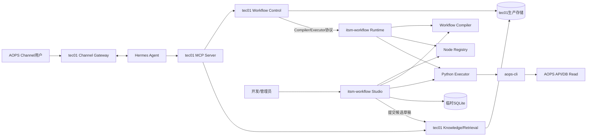
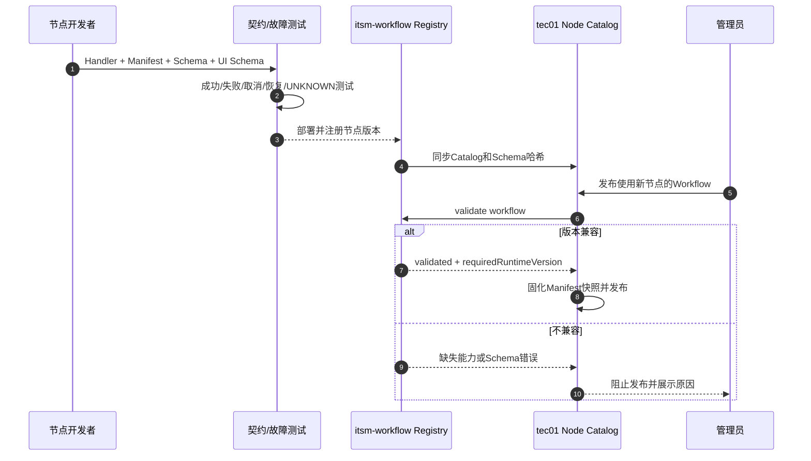
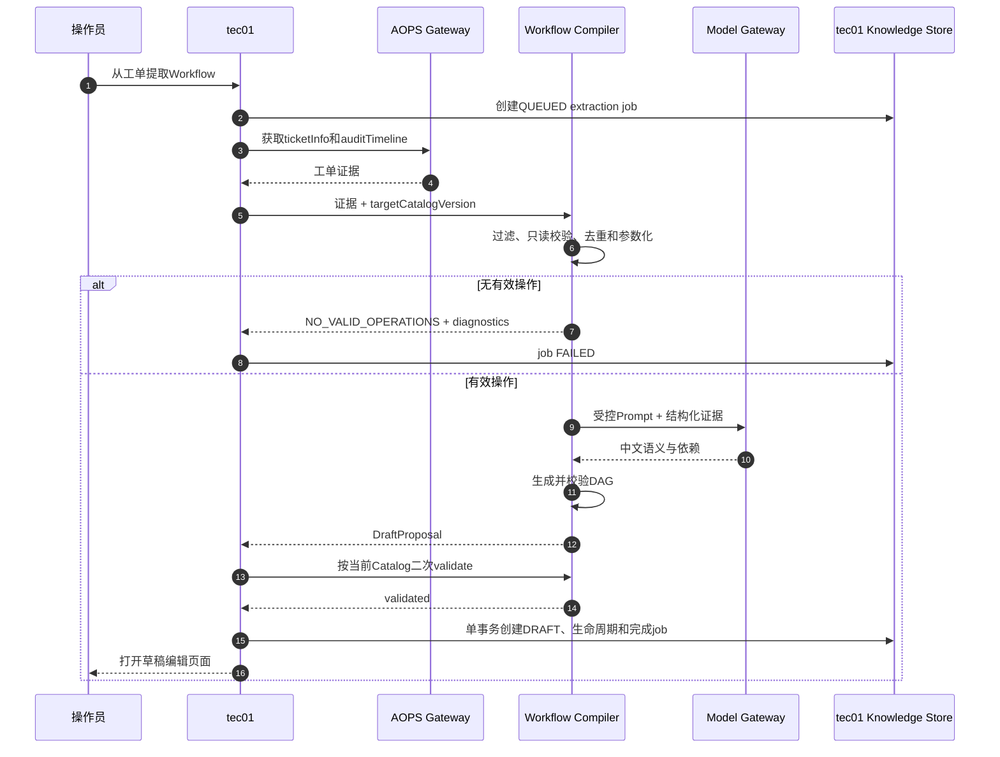
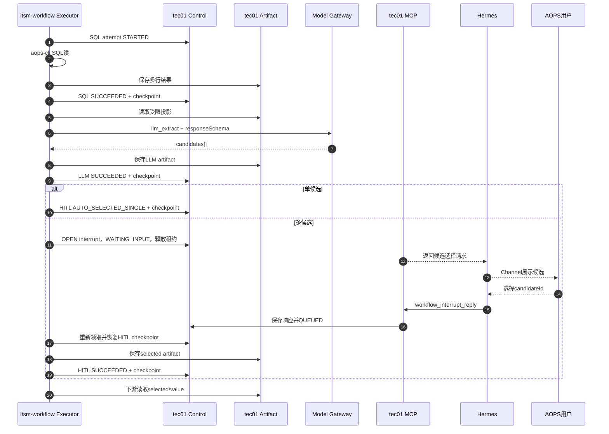
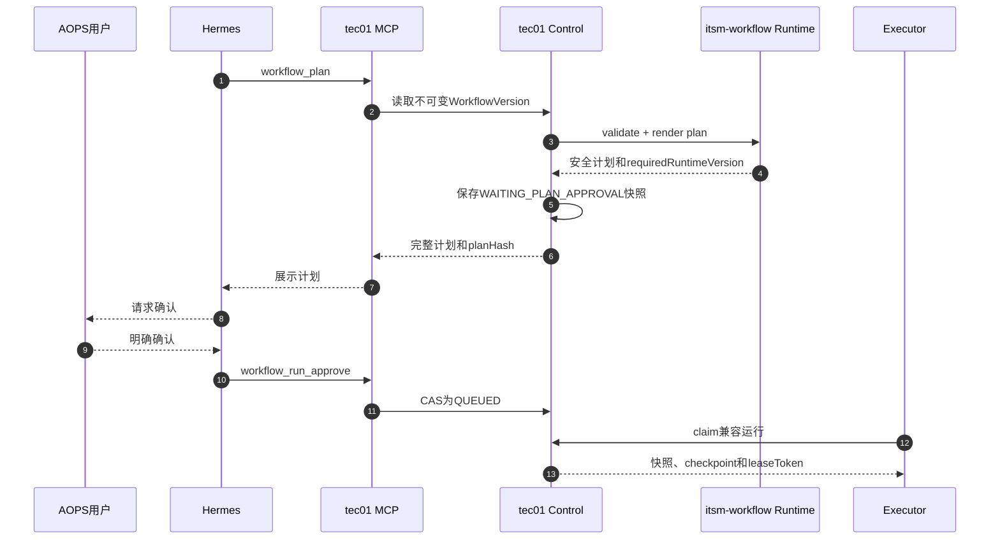
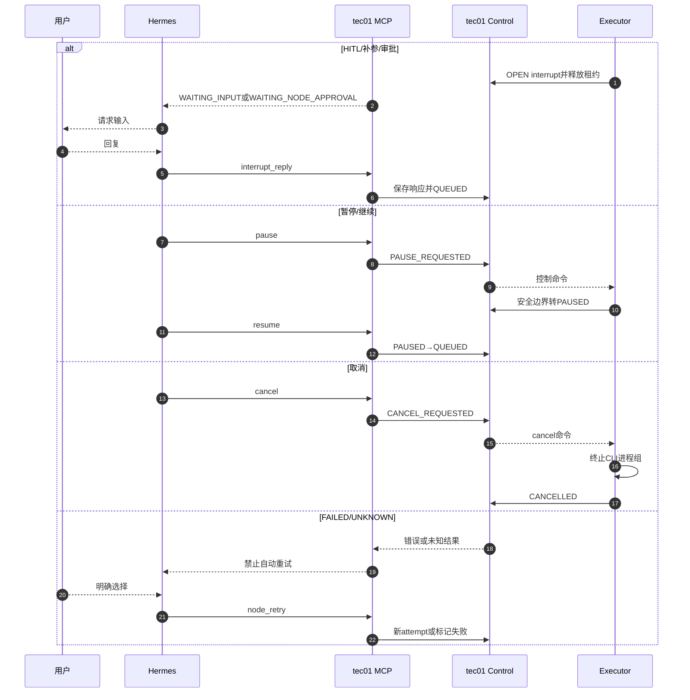
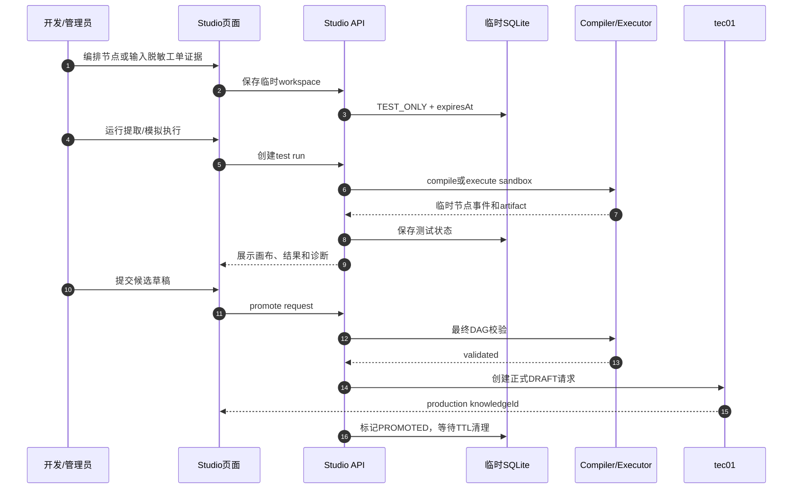

# tec01控制面与itsm-workflow计算执行平台设计

## 最终结论

取消Java执行器计划。目标架构固定为：

- **tec01（Java控制面）**：AOPS Channel网关、Hermes MCP、生产身份与权限、知识和版本、计划与运行状态、中断、审批、事件、artifact、checkpoint及审计的唯一生产事实源。
- **itsm-workflow（Python计算执行平台）**：Workflow草稿编译、节点定义与Schema、DAG校验、计划渲染、节点执行、`aops-cli`适配、LLM/HITL运行语义及节点扩展。
- **itsm-workflow Studio**：独立开发调试页面，使用服务端轻量级SQLite保存有TTL的临时草稿和测试运行；浏览器`localStorage`只保存无敏感信息的UI偏好。

这比同时维护两套Executor实现更简单，也能确保“草稿提取生成的节点”和“生产实际执行的节点”使用同一套定义、校验器和Handler。

## 总体架构



## 服务职责

### tec01

| 模块 | 职责 |
|---|---|
| Channel Gateway | AOPS用户消息接入、Channel会话和消息发送 |
| MCP Server | 知识匹配、计划、确认、状态等待、补参、暂停、继续、取消、重试和结果读取 |
| Identity & Policy | UID映射、管理员/操作员权限、知识可见范围和运行访问控制 |
| Knowledge & Retrieval | 草稿、审核、发布、不可变版本、生命周期、全文/向量/rerank和导入导出 |
| Workflow Control | `planHash`、运行状态机、revision CAS、幂等请求、审批和中断 |
| Lease & Attempt Ledger | 任务领取、租约、心跳、attempt和UNKNOWN协调 |
| Event & Notification | 事件sequence、MCP wait、Web SSE和Channel主动通知去重 |
| Artifact & Checkpoint | 生产SQL结果、LLM结果、HITL选择、诊断和恢复checkpoint |
| Credential Broker | 托管AOPS凭据并向有效Executor租约发放短期执行凭据 |
| Production API/UI | 生产知识管理、运行中心、审核、查询和审计 |

### itsm-workflow

| 模块 | 职责 |
|---|---|
| Workflow Compiler | 过滤工单操作、只读SQL分析、去重、参数化、LLM中文提炼和DAG草稿生成 |
| Node Registry | 节点Manifest、配置/输入/输出Schema、风险级别、兼容版本和Handler注册 |
| Plan Builder | 对不可变DAG进行二次校验，解析运行输入并生成安全计划材料 |
| Executor | DAG调度、节点边界checkpoint、条件分支、输出绑定、interrupt和恢复 |
| Node Handlers | `sql_read/condition/llm_extract/hitl_select/human_input/approval/end`及后续扩展 |
| CLI Adapter | 参数数组调用`aops-cli`、SSE解析、超时、取消、输出限制和诊断脱敏 |
| Remote State Client | 通过tec01协议提交attempt、事件、artifact、checkpoint和租约心跳 |
| Studio API/UI | 节点浏览、DAG编排、草稿提取调试、模拟执行和测试结果查看 |
| Temporary Store | 仅保存非生产临时草稿和测试运行，TTL到期自动清理 |

### 明确边界

- tec01拥有全部生产业务数据，itsm-workflow不建立生产业务数据库。
- 节点定义和执行代码以itsm-workflow Node Registry为源；tec01保存发布版本所引用的Manifest快照。
- itsm-workflow不能直接发布知识，只能向tec01提交候选草稿。
- Studio临时测试状态不能被Hermes生产MCP匹配，也不能成为生产运行事实。
- itsm-workflow的SQLite故障不能影响tec01中已经发布的知识或生产运行状态。

## 生产计划和状态保存在哪里

全部保存在tec01：

| 实体 | 内容 |
|---|---|
| `workflow_versions` | 不可变DAG、Node Catalog版本、Manifest快照和内容哈希 |
| `workflow_runs` | 计划快照、工单ID、输入、`planHash`、状态、revision |
| `workflow_node_states` | 每个节点的状态、当前attempt和输出引用 |
| `workflow_attempts` | STARTED、Handler版本、Executor、退出码、错误和完成时间 |
| `workflow_interrupts` | HITL、补参和审批请求及用户响应 |
| `workflow_events` | 单调sequence、进度、安全摘要和通知状态 |
| `workflow_artifacts` | SQL输出、LLM候选、HITL选择和失败诊断 |
| `workflow_checkpoints` | Python执行游标、pending writes和格式版本 |
| `workflow_credentials` | 加密凭据或短期凭据引用 |

计划创建时tec01保存完整快照，并初始化所有节点为`PENDING`。Executor只领取快照和短期租约。节点完成时，tec01必须在一个事务中提交：

```text
attempt完成
节点状态变化
artifact正式引用
workflow event
checkpoint引用
run revision递增
```

Executor内存中的状态不是事实。只有tec01提交成功，Web、Hermes和Channel才能向用户展示该节点已经完成。

## 节点定义由itsm-workflow管理

### Node Manifest

每个节点由itsm-workflow注册：

```text
type
schemaVersion
handlerVersion
configSchema
inputSchema
outputSchema
uiSchema
riskLevel
approvalPolicy
idempotencyClass
resumeSemantics
resultSensitivity
```

示例：

```json
{
  "type": "llm_extract",
  "schemaVersion": 1,
  "handlerVersion": "1.0.0",
  "riskLevel": "LOW",
  "idempotencyClass": "REPLAY_WITH_STORED_RESULT",
  "resumeSemantics": "CHECK_RESULT_THEN_RETRY",
  "configSchema": {},
  "inputSchema": {},
  "outputSchema": {},
  "uiSchema": {}
}
```

tec01定期同步Node Catalog并保存：

```text
catalogVersion
nodeType
schemaVersion
handlerVersion范围
Schema内容哈希
状态：ACTIVE / DEPRECATED / DISABLED
```

知识发布时，tec01调用itsm-workflow校验完整DAG，并将使用的Catalog/Schema快照固化到工作流版本。生产执行时itsm-workflow确认自己仍支持该快照；不支持时运行不能入队。

### 新节点扩展流程



约束：

- 节点代码随itsm-workflow部署，禁止从数据库加载任意Python代码或Shell模板。
- 兼容修改只能增加可选字段；破坏性修改必须增加`schemaVersion`。
- `handlerVersion`升级不能静默改变已发布版本的输入输出语义。
- 下线旧Handler前必须确认没有活跃或可重试运行引用它。
- 高风险节点审批策略由平台强制，知识作者不能关闭。

## Workflow草稿提取

草稿提取由itsm-workflow Compiler执行，tec01负责证据获取、任务状态和草稿保存。

### 职责分配

| 环节 | 责任方 |
|---|---|
| 用户请求、权限、创建人和授权UID | tec01 |
| 获取`ticketInfo`和`auditTimeline` | tec01 AOPS Gateway |
| 过滤失败记录、SQL只读校验、去重与参数化 | itsm-workflow Compiler |
| LLM结构化中文提炼和依赖识别 | Compiler通过受控Model Gateway |
| DAG和Node Manifest校验 | Compiler第一次校验，tec01保存前再次调用Runtime校验 |
| extraction job、DRAFT、生命周期 | tec01 |
| 编辑、审核、发布和索引 | tec01 |

### 草稿编译协议

```http
POST /internal/v1/compiler/workflow-drafts
```

```json
{
  "extractionId": "ext_xxx",
  "ticketInfo": {},
  "auditTimeline": [],
  "targetCatalogVersion": "2026-09-17",
  "locale": "zh-CN"
}
```

返回候选定义和诊断，不写数据库：

```json
{
  "compilerVersion": "1.0.0",
  "evidenceHash": "sha256...",
  "name": "客户信息查询",
  "summary": "根据工单条件查询客户信息",
  "matchPhrases": ["客户信息查询"],
  "negativePhrases": [],
  "systemKeys": ["crm"],
  "workflowDefinition": {},
  "diagnostics": {
    "auditOperationCount": 5,
    "acceptedOperationCount": 2,
    "ignoredOperations": []
  }
}
```

tec01保存`workflow_extraction_jobs`，相同`ticketId + evidenceHash + compilerVersion + promptVersion`使用幂等结果。LLM失败、没有有效操作或DAG不合法时只保存失败诊断，不生成兜底草稿。

### 提取泳道图



## SQL、LLM和HITL扩展场景

推荐DAG：

```text
sql_read → llm_extract → hitl_select → downstream_node
```

### `llm_extract`

- 输入前置SQL artifact的受限行列投影。
- 只引用批准的`modelProfile`和`promptTemplateId`，知识定义不能填写模型URL或凭据。
- 使用JSON Schema强制输出`candidates[]`。
- 保存输入哈希、模型版本、提示词版本和响应哈希。
- 自然语言输出未经Schema校验不得传给下游。

示例输出：

```json
{
  "candidates": [
    {"id":"candidate-1","label":"客户A / 0001","value":"0001","reason":"姓名和手机号一致"},
    {"id":"candidate-2","label":"客户A / 0002","value":"0002","reason":"姓名一致"}
  ]
}
```

### `hitl_select`

| 候选数量 | 行为 |
|---:|---|
| 0 | 根据`zeroCandidatePolicy`请求人工输入或失败 |
| 1 | 自动选择并记录`AUTO_SELECTED_SINGLE`事件 |
| 多个 | 在tec01创建OPEN interrupt，运行进入`WAITING_INPUT`并释放Executor租约 |

用户通过Channel选择`candidateId`后，Hermes调用tec01 MCP。tec01保存interrupt response并重新入队；Executor恢复HITL checkpoint，提交：

```json
{
  "selected": {
    "id": "candidate-1",
    "value": "0001"
  }
}
```

下游节点通过`/selected/value`读取已确认参数。

### 运行泳道图



恢复规则：

- LLM使用`runId + nodeId + inputHash + promptVersion`作为幂等键。
- 已保存模型响应时复用原结果，避免重试产生不同候选。
- HITL interrupt和用户回复由tec01持久化，等待期间不占用Executor并发。
- 重复回复返回原结果；过期revision或非法candidateId返回冲突。

## 生产执行与控制

### 计划、确认和执行



### 中断、继续、取消和重试



## 独立Studio页面

建议保留并独立部署itsm-workflow Studio，用于：

- 查看Node Catalog和节点Schema。
- 图形化编排临时DAG。
- 输入`ticketInfo/auditTimeline`调试草稿提取。
- 使用脱敏样例执行节点和条件分支。
- 模拟LLM结构化输出和HITL候选选择。
- 查看临时事件、artifact、checkpoint和失败诊断。
- 将审核后的候选草稿提交到tec01进入正式审核。

Studio使用tec01 SSO或短期开发JWT。生产Channel用户不会访问Studio，Studio也不能直接将临时测试运行标为生产成功。

## 临时测试存储选择

### 推荐：服务端SQLite为主，localStorage为辅

| 方案 | 优点 | 缺点 | 使用建议 |
|---|---|---|---|
| 服务端SQLite | 支持多页面恢复、共享测试、事件查询、artifact和TTL清理；更接近生产状态模型 | 需要文件目录、迁移和清理任务 | **作为Studio临时测试主存储** |
| `localStorage` | 实现简单、无需服务端表 | 容量小、同步阻塞、浏览器可读、不可共享、清理和审计弱 | 只保存UI偏好和无敏感未提交快照 |
| IndexedDB | 容量和结构优于localStorage | 仍局限单浏览器，安全边界与localStorage相同 | 可选保存大型非敏感画布草稿，不作为运行状态源 |
| 内存 | 无残留、速度快 | 刷新或重启即丢失 | 单次节点单元测试 |

### SQLite保存内容

建议表：

```text
studio_workspaces
studio_drafts
studio_test_runs
studio_test_node_states
studio_test_events
studio_test_artifacts
studio_extraction_jobs
```

规则：

- 明确标记`TEST_ONLY`，ID使用`test_`前缀。
- 默认TTL 24小时，可配置到72小时；后台定期清理。
- 设置单workspace、单artifact和数据库总容量限制。
- 不保存AOPS API Key、Authorization Header或生产凭据。
- 默认使用脱敏工单证据和模拟CLI；连接真实测试环境必须二次确认。
- SQLite文件与tec01生产数据库没有同步或复制关系。
- 多实例Studio不能共享单机SQLite；需要多实例时改用独立测试数据库，不影响Executor协议。

### localStorage允许内容

```text
画布缩放和面板布局
最近选择的节点类型
主题和每页数量
未提交且确认不含敏感值的表单快照
```

禁止保存：

```text
AOPS API Key或任何Token
ticketInfo和auditTimeline原文
SQL真实查询结果
LLM输入输出中的客户数据
生产runId对应的状态副本
加密密钥或凭据引用
```

localStorage不是可信状态源；浏览器中的内容只能作为编辑便利，提交时必须由Studio API重新校验。

### Studio测试泳道图



“提交候选草稿”不是发布：tec01仍创建`DRAFT`，后续必须走正式编辑、审核和发布流程。

## itsm-workflow内部模块结构

建议单仓库、共享Schema包、分进程运行：

```text
workflow-schema
  node manifests
  JSON schemas
  compatibility rules

workflow-compiler
  audit filtering
  SQL parameterization
  LLM draft extraction

workflow-executor
  DAG runtime
  handlers
  remote state client
  aops-cli adapter

workflow-studio
  Studio API
  React UI
  temporary SQLite
```

Compiler、Executor和Studio共享`workflow-schema`，但只有Executor加载生产节点执行Handler；Studio调用相同Handler时必须运行在测试模式或sandbox上下文。

## 内部接口

### tec01调用itsm-workflow

```text
GET  /internal/v1/node-catalog
POST /internal/v1/workflows/validate
POST /internal/v1/workflows/plan
POST /internal/v1/compiler/workflow-drafts
POST /internal/v1/execution/claims
POST /internal/v1/execution/claims/{leaseToken}/heartbeat
GET  /internal/v1/execution/claims/{leaseToken}/commands
```

实际领取方向可以由Executor长轮询tec01；接口命名按最终网络方向调整，但状态和幂等语义不变。

### itsm-workflow回写tec01

```text
POST /internal/v1/runs/{runId}/attempts/start
POST /internal/v1/runs/{runId}/attempts/{attemptId}/complete
POST /internal/v1/runs/{runId}/attempts/{attemptId}/fail
PUT  /internal/v1/runs/{runId}/artifacts/{artifactId}
PUT  /internal/v1/runs/{runId}/checkpoints/{checkpointId}
POST /internal/v1/runs/{runId}/interrupts
```

所有生产写请求携带：

```text
leaseToken
expectedRevision
idempotencyKey
runtimeVersion
handlerVersion
payloadHash
```

## 分阶段落地

### 阶段1：tec01接管MCP和生产存储

- 在tec01实现现有MCP工具和生产状态机。
- Hermes只连接tec01 MCP。
- 知识、版本、运行、事件、artifact和checkpoint迁入tec01。

### 阶段2：拆分Workflow Schema与Compiler

- 从当前服务提取Node Manifest和兼容校验包。
- 将草稿提取改为无存储Compiler协议。
- tec01保存extraction job和DRAFT。

### 阶段3：Executor无数据库化

- 接入tec01租约、attempt、artifact和Remote Checkpointer协议。
- 新运行写tec01；旧运行排空并转只读。
- 验证中断、继续、取消、重试和UNKNOWN语义。

### 阶段4：Studio和临时SQLite

- 保留独立编排与调试页面。
- 临时数据明确`TEST_ONLY`并启用TTL和容量限制。
- 建立“提交到tec01 DRAFT”流程，不允许直接发布。

### 阶段5：扩展LLM/HITL节点

- 实现`llm_extract`结构化输出、幂等和数据策略。
- 实现`hitl_select`单候选自动选择和多候选持久化interrupt。
- 通过Channel端到端验证长时间等待和恢复。

## 验收标准

- tec01是所有生产计划和运行状态的唯一事实源。
- itsm-workflow删除生产数据库配置后，Compiler和Executor仍能完整工作。
- 草稿提取、DAG校验和生产Executor引用同一Node Manifest版本。
- SQL多行结果可以经过LLM结构化，并在多候选时通过Channel完成HITL选择。
- Hermes、Executor或Studio重启不会丢失tec01中的生产中断和运行状态。
- SQLite删除或损坏只影响临时Studio测试，不影响生产知识和运行。
- localStorage中搜索不到Token、工单证据、SQL结果或客户数据。
- 新节点在契约、恢复和故障测试完成前不能进入生产Catalog。

## 最终建议

采用“**tec01生产控制面与唯一存储 + itsm-workflow统一计算执行平台**”。itsm-workflow同时管理Workflow Compiler、Node Registry和Python Executor，从而保证提取、定义和执行语义一致；tec01负责MCP、生产状态与数据治理。保留独立Studio页面，并使用带TTL的服务端SQLite作为临时测试主存储，localStorage只保存无敏感UI偏好。该方案比维护Java/Python双Executor更简单，也更适合持续增加LLM、HITL及其他节点类型。
