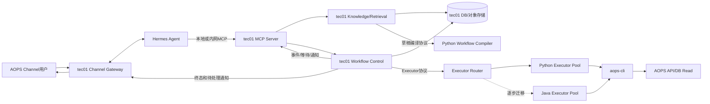
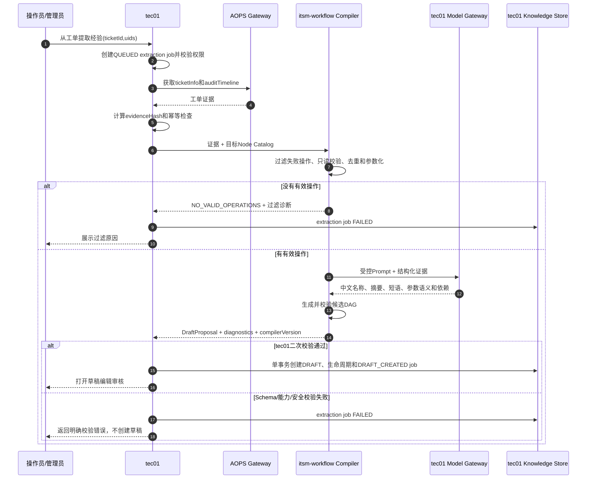
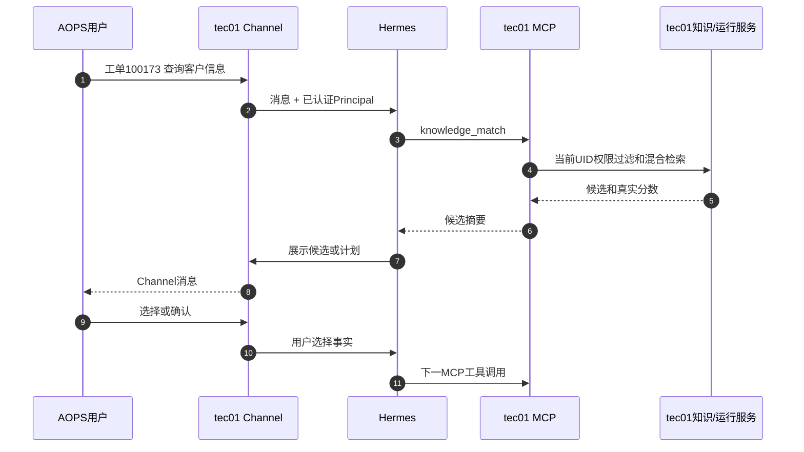
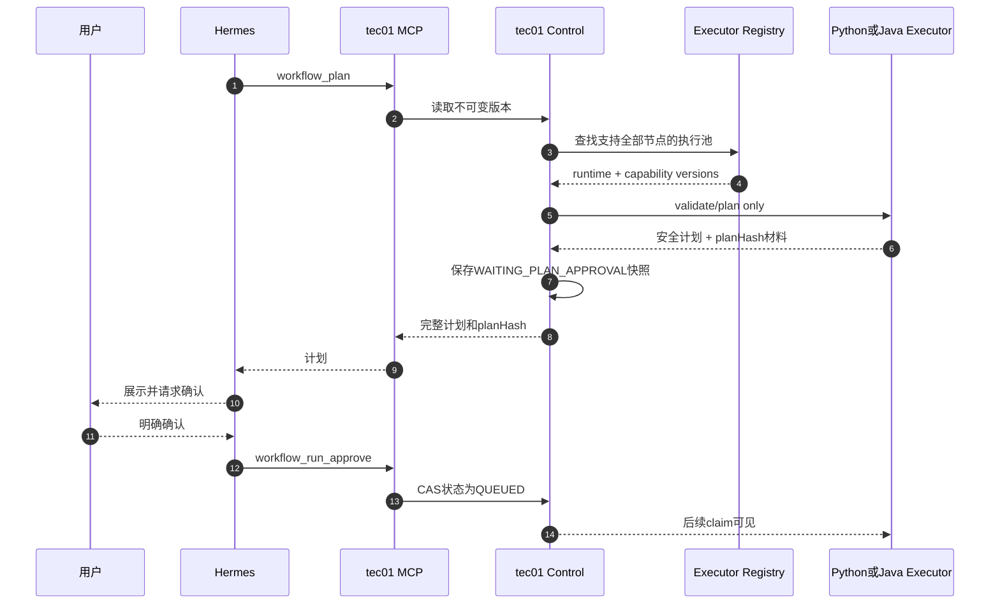
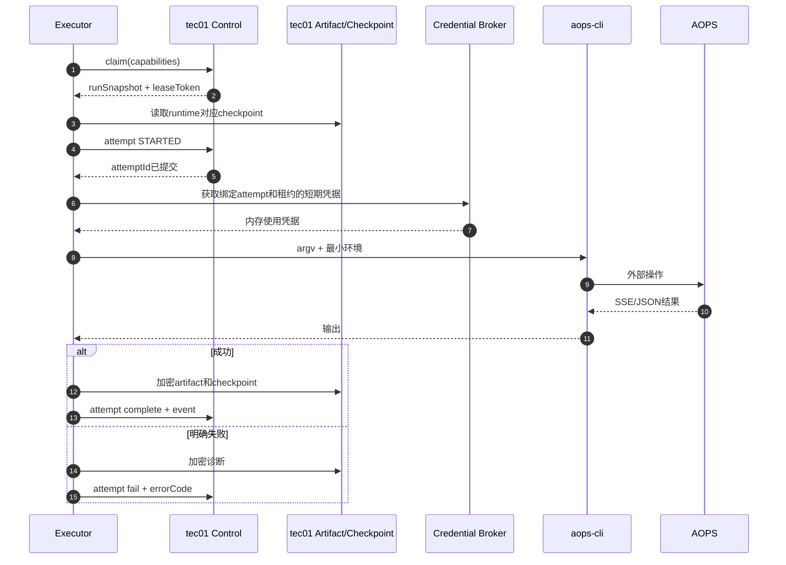
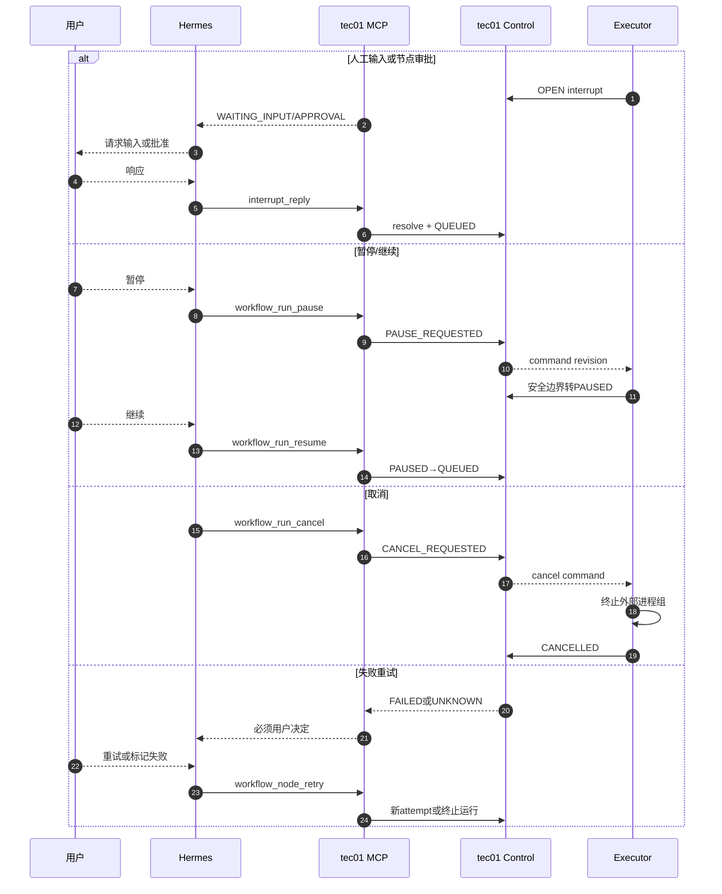
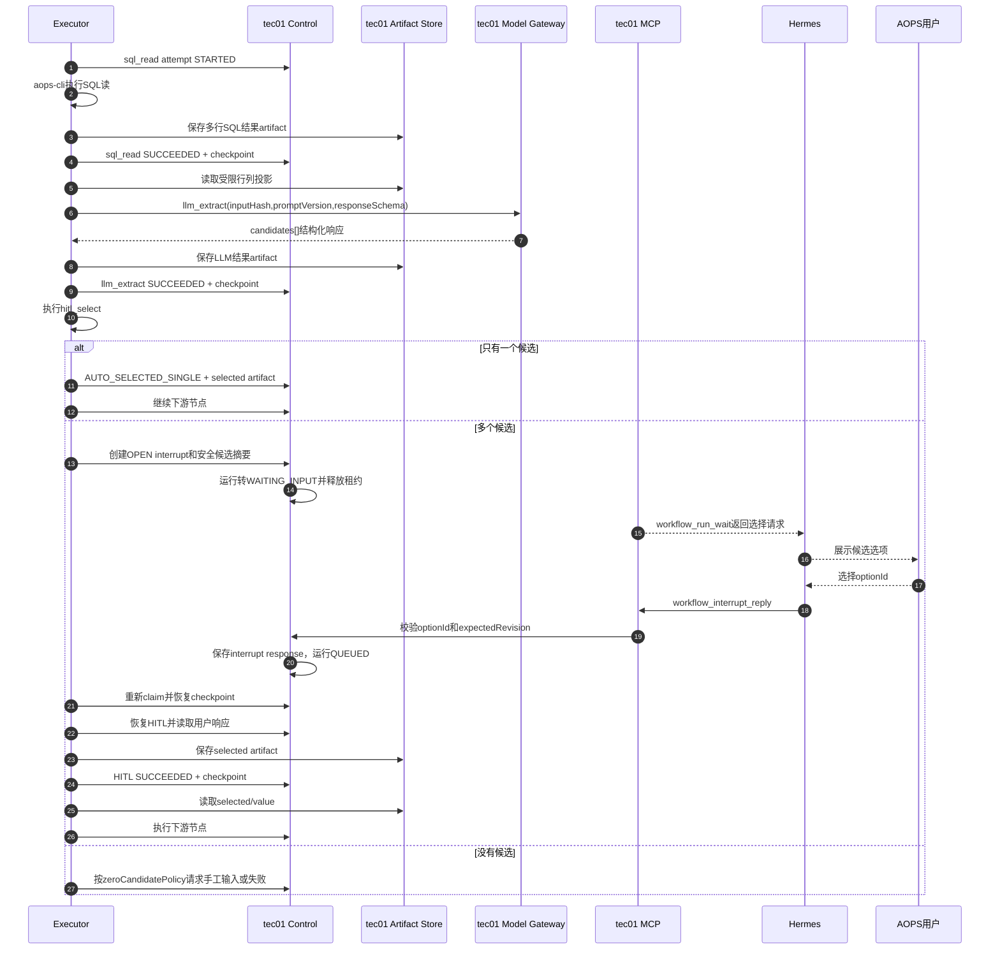
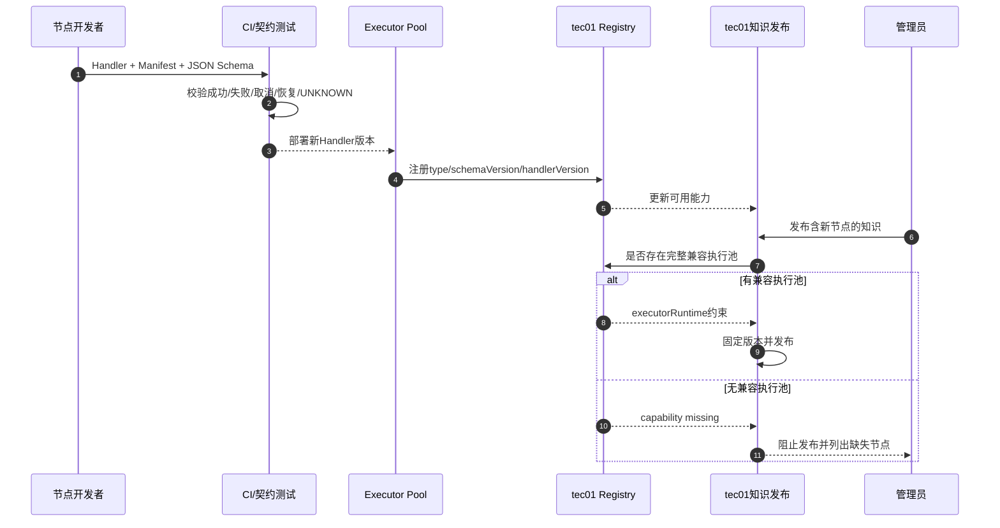
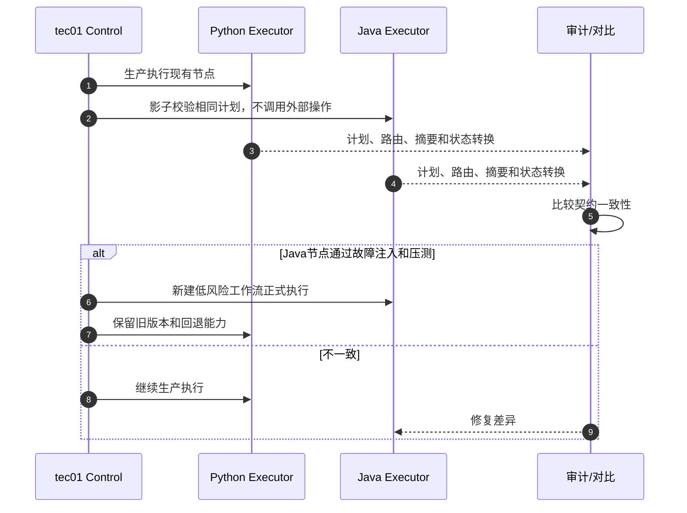

# tec01统一控制面、MCP与可替换执行器设计

## 决策结论

### MCP迁入tec01

推荐。tec01同时是 AOPS Channel网关，并拥有用户身份、知识、检索、工作流版本和运行状态。MCP属于Hermes访问控制面的工具协议，放在tec01可以：

- 直接复用Channel用户身份和会话，不再把用户凭据跨服务传到Python MCP。
- 直接读取知识和运行事实，减少一次HTTP转发及双重鉴权。
- 在同一事务边界内处理计划确认、中断、继续、取消和重试。
- 由tec01统一向 AOPS Channel推送进度，避免MCP轮询结果与主动消息重复。

迁移后Python端不再提供MCP，也不再提供知识、管理或用户REST API。

### 执行器是否迁入tec01

技术上可行，但建议分阶段：

1. **近期推荐架构**：tec01承担Channel、MCP、控制面和全部存储；itsm-workflow保留无存储的Workflow Compiler和Python Executor，分别负责草稿编译与运行执行。
2. **中期兼容架构**：建立语言无关Executor协议，Python与Java Executor并存，tec01根据工作流能力选择执行池。
3. **长期可选架构**：Java Executor通过等价验收后接管全部节点，Python Executor退役。

当前流程是确定性DAG，Java完全可以实现。但如果继续依赖LangGraph的checkpoint、interrupt和durable execution语义，官方文档当前主要提供 [Python](https://docs.langchain.com/oss/python/langgraph/overview) 和 [JavaScript](https://docs.langchain.com/oss/javascript/langgraph/install) 运行时；全Java迁移意味着tec01需要自行实现或替换这些运行时语义，而不是简单翻译节点代码。LangGraph也明确依赖checkpointer完成持久化与恢复，[生产持久化说明](https://docs.langchain.com/oss/python/langgraph/add-memory)中的这些能力必须在Java执行器中等价实现。

## 推荐目标架构



### 部署单元

| 部署单元 | 技术 | 职责 | 是否持久化 |
|---|---|---|---|
| `tec01-gateway-control` | Java | Channel、MCP、身份、知识、检索、版本、计划、运行状态机、事件、审批、中断、导入导出 | 是，唯一业务事实源 |
| `itsm-workflow-compiler` | Python，近期保留 | SQL审计过滤、只读校验、参数化、LLM结构化分析和DAG草稿生成 | 否，输入输出均通过tec01 |
| `tec01-executor-java` | Java，可后续增加 | DAG调度、Java节点Handler、CLI控制、恢复协调 | 否，通过Executor协议访问tec01 |
| `itsm-workflow-executor-python` | Python，近期保留 | LangGraph、现有节点Handler、CLI控制、Remote Checkpointer客户端 | 否，通过Executor协议访问tec01 |

即便最终全部使用Java，也建议将Gateway/Control和Executor作为不同进程或部署单元。`aops-cli`子进程、节点超时和Worker重启不应影响 AOPS Channel接入与用户消息。

Workflow Compiler和Executor也应保持模块边界：Compiler处理“把历史工单经验编译为候选DAG”，Executor处理“运行已发布的不可变DAG”。两者可以共用Node Manifest、SQL安全校验和数据类型库，但不能共用运行内存或本地持久化。

## 计划和运行状态保存在哪里

**全部保存在tec01。**“Python无业务存储”表示Python不拥有数据库，不表示运行过程没有状态。Executor执行节点时可以在内存中持有短期上下文，但任何可恢复事实都必须提交到tec01后才算生效。

tec01至少持有以下实体：

| 实体 | 保存内容 | 产生时机 |
|---|---|---|
| `workflow_versions` | 不可变DAG、节点Schema版本、内容哈希 | 知识发布时 |
| `workflow_runs` | 版本快照、工单ID、运行输入、`planHash`、运行状态、revision、目标Executor runtime | 生成计划时 |
| `workflow_node_states` | 每个节点的 `PENDING/READY/RUNNING/WAITING/SUCCEEDED/FAILED/SKIPPED/UNKNOWN`、当前attempt和输出引用 | 计划创建时初始化，执行中更新 |
| `workflow_attempts` | STARTED时间、Executor、lease、Handler版本、退出码、错误类别和完成时间 | 每次节点执行前创建 |
| `workflow_interrupts` | HITL/审批/补参请求、候选项、状态、用户响应和处理人 | 节点需要人工参与时 |
| `workflow_events` | 单调sequence、安全摘要、节点进度和Channel通知状态 | 每次已提交状态变化时 |
| `workflow_artifacts` | SQL结果、LLM结构化结果、HITL选择、失败诊断 | 节点产生输出时 |
| `workflow_checkpoints` | runtime、格式版本、执行游标、pending writes | 节点边界或interrupt时 |
| `workflow_credentials` | 加密凭据或短期凭据引用 | 创建运行或凭据刷新时 |

计划创建后的tec01记录示意：

```json
{
  "runId": "run_xxx",
  "workflowVersionId": "wfv_12",
  "status": "WAITING_PLAN_APPROVAL",
  "revision": 1,
  "planHash": "sha256...",
  "workflowSnapshot": {},
  "runInputs": {},
  "nodeStatuses": {
    "sql-read": "PENDING",
    "llm-extract": "PENDING",
    "hitl-select": "PENDING",
    "sql-next": "PENDING"
  },
  "executorRuntime": "python-langgraph"
}
```

状态保持原则：

1. Hermes通过tec01 MCP创建计划，tec01保存完整版本快照和全部节点初始状态。
2. 用户确认后，tec01以CAS把运行从`WAITING_PLAN_APPROVAL`改为`QUEUED`。
3. Executor领取运行，只得到快照、当前状态、checkpoint和短期租约。
4. 节点开始前，Executor必须让tec01提交`STARTED attempt`。
5. 节点完成时，tec01在一个事务中提交节点状态、事件、artifact引用和对应checkpoint；不能分别成功。
6. Executor崩溃后，新Executor从tec01最近已提交的节点状态和checkpoint恢复。

为了避免tec01节点状态和LangGraph checkpoint出现双事实源，节点完成接口应支持原子提交：artifact可以先上传为临时对象，但`attempt complete + node transition + event + checkpoint reference`必须在tec01同一事务中完成。checkpoint只描述执行游标，面向用户的运行和节点状态始终以tec01业务表为准。

## Workflow草稿提取放在哪里

推荐交给itsm-workflow，但作为独立的**无存储Workflow Compiler**，不归Executor运行循环，也不继续承担草稿持久化。

职责分配：

| 环节 | 责任方 |
|---|---|
| 接收用户“从工单提取经验”请求 | tec01 Channel/Admin API |
| 校验创建人、授权UID和工单访问权限 | tec01 |
| 获取工单详情与audit timeline | 优先由tec01 AOPS网关获取 |
| 过滤失败操作、只读SQL校验、去重和参数化 | itsm-workflow Compiler |
| LLM中文提炼、参数语义和依赖生成 | itsm-workflow Compiler通过tec01 Model Gateway |
| 校验目标Node Catalog版本 | Compiler生成时校验，tec01保存前再次校验 |
| 保存提取任务、诊断和DRAFT | tec01 |
| 人工编辑、提交审核、发布和向量索引 | tec01 |

这样分配的原因：

- 现有Python已经具备`sqlglot`只读SQL分析、历史值参数化、审计结果过滤和结构化LLM提炼能力，复用成本最低。
- 草稿生成必须与Executor的节点Schema和参数绑定语义一致，共享Manifest/Schema库可以减少“能生成但不能执行”的漂移。
- tec01仍是唯一事实源；Compiler只返回候选定义，不能自行创建知识ID、改变审核状态或发布版本。
- tec01作为Channel网关获取工单证据，可以避免把长期AOPS用户凭据传给Compiler。确需Compiler调用`aops-cli`时，也只能使用tec01签发的短期、单次证据读取凭据。

### tec01提取任务状态

tec01保存`workflow_extraction_jobs`：

```text
extractionId
creatorUid
ticketId
status: QUEUED / ANALYZING / DRAFT_CREATED / FAILED
evidenceHash
compilerVersion
nodeCatalogVersion
promptVersion
diagnostics
knowledgeId
createdAt / startedAt / finishedAt
```

相同`ticketId + evidenceHash + compilerVersion + promptVersion`的重复请求使用幂等键返回已有结果，避免重复调用LLM。

### 草稿编译协议

```http
POST /internal/v1/compiler/workflow-drafts
```

请求由tec01发起：

```json
{
  "extractionId": "ext_xxx",
  "ticketInfo": {},
  "auditTimeline": [],
  "targetNodeCatalog": {
    "catalogVersion": "2026-09-17",
    "nodeTypes": [
      {"type":"sql_read","schemaVersion":1},
      {"type":"condition","schemaVersion":1},
      {"type":"hitl_select","schemaVersion":1},
      {"type":"llm_extract","schemaVersion":1},
      {"type":"end","schemaVersion":1}
    ]
  },
  "locale": "zh-CN"
}
```

Compiler返回候选结果，不写数据库：

```json
{
  "compilerVersion": "1.0.0",
  "evidenceHash": "sha256...",
  "name": "客户信息查询",
  "summary": "根据工单条件查询客户信息",
  "matchPhrases": ["客户信息查询"],
  "negativePhrases": [],
  "systemKeys": ["crm"],
  "workflowDefinition": {},
  "diagnostics": {
    "auditOperationCount": 5,
    "acceptedOperationCount": 2,
    "ignoredOperations": []
  }
}
```

tec01收到响应后再次执行Schema、节点能力、只读SQL、依赖和敏感字段校验，随后在一个事务中创建知识`DRAFT`、生命周期事件并完成extraction job。LLM失败、无有效操作或Compiler响应不合法时只更新job为`FAILED`，不得生成兜底草稿。

## tec01职责

| 模块 | 主要职责 |
|---|---|
| Channel Gateway | 接收AOPS消息、维护会话、调用Hermes、发送Agent响应和主动通知 |
| MCP Server | 暴露知识匹配、计划、批准、状态等待、中断回复、暂停、继续、取消、重试、结果读取等工具 |
| Identity & Policy | Channel用户到UID映射、管理员/操作员权限、知识可见范围和运行访问控制 |
| Knowledge & Retrieval | 草稿、审核、发布、版本、生命周期、全文/向量/RRF/rerank和授权UID |
| Extraction Job | 保存提取任务、证据哈希、Compiler版本、过滤诊断和最终知识ID |
| Workflow Control | `planHash`、运行状态机、revision CAS、幂等控制、中断、审批和路由到Executor |
| Executor Registry | Executor注册、健康状态、节点能力、版本兼容和调度选择 |
| Lease & Attempt Ledger | 领取、租约、心跳、attempt STARTED/完成/失败、UNKNOWN协调 |
| Event & Notification | 单调事件sequence、MCP wait、Web SSE、Channel主动通知和eventId去重 |
| Artifact & Checkpoint | 节点结果、失败诊断、checkpoint、pending writes、加密和保留期清理 |
| Credential Broker | 托管AOPS凭据，向持有有效租约的Executor发放短期或信封加密执行凭据 |
| Admin & Integration API | 管理页面、精确查询、导入导出、路径替换和三方REST API |

## MCP迁移到tec01后的工具职责

| MCP工具 | tec01内部实现 |
|---|---|
| `knowledge_match` | 直接调用Knowledge/Retrieval并按当前Channel UID过滤 |
| `knowledge_get` | 返回不可变版本、运行参数、依赖、条件和当前工单comment |
| `workflow_plan` | 调用Executor Planner校验DAG并由Control保存计划快照与`planHash` |
| `workflow_run_approve` | Control执行CAS状态转换并入队 |
| `workflow_run_get/wait` | 直接读取tec01运行状态和事件序列 |
| `workflow_run_pause/resume/cancel` | 写入控制意图，由Executor在心跳或安全边界消费 |
| `workflow_interrupt_reply` | 解析用户输入，关闭interrupt并重新入队 |
| `workflow_node_retry` | 必须有用户确认；创建新attempt或标记UNKNOWN失败 |
| `workflow_node_result_get` | 从tec01加密artifact读取当前运行结果并分页 |

Hermes只连接tec01 MCP，不再连接Python服务。对于tec01进程内的Hermes，可直接使用经过认证的Channel Principal；远程Hermes使用短期会话JWT或服务间mTLS，不能把长期AOPS API Key放入工具参数。

## 执行器协议

执行器协议是未来新增节点和Java迁移的核心。协议必须与语言无关，使用版本化JSON Schema或Protobuf，不能暴露Python类或Java类名。

### Executor注册与能力协商

```http
POST /internal/v1/executors/register
POST /internal/v1/executors/{executorId}/heartbeat
DELETE /internal/v1/executors/{executorId}
```

注册示例：

```json
{
  "executorId": "python-worker-t1361-01",
  "runtime": "python-langgraph",
  "runtimeVersion": "0.6.3",
  "protocolVersion": 1,
  "maxConcurrency": 2,
  "nodeCapabilities": [
    {"type":"sql_read","schemaVersion":1,"handlerVersion":"1.2.0"},
    {"type":"condition","schemaVersion":1,"handlerVersion":"1.0.0"},
    {"type":"human_input","schemaVersion":1,"handlerVersion":"1.0.0"},
    {"type":"approval","schemaVersion":1,"handlerVersion":"1.0.0"},
    {"type":"end","schemaVersion":1,"handlerVersion":"1.0.0"}
  ]
}
```

tec01发布知识时必须确认至少一个执行池支持该版本全部节点。第一阶段一个运行只能由同一类Executor完成，避免跨语言checkpoint和局部状态迁移；后续确有必要时再设计节点级异构调度。

### 节点类型清单

每种节点必须注册：

```text
type
schemaVersion
handlerVersion
configSchema
inputSchema
outputSchema
riskLevel
approvalPolicy
idempotencyClass
resumeSemantics
resultSensitivity
```

- `schemaVersion`定义持久化配置协议。
- `handlerVersion`定义执行实现，用于兼容判断和审计。
- `idempotencyClass`至少区分 `READ_SAFE`、`EXTERNAL_IDEMPOTENT`、`NON_IDEMPOTENT`。
- `resumeSemantics`定义崩溃后可自动恢复、必须协调或永远进入UNKNOWN。

节点代码必须随Executor部署，不允许从数据库加载任意Java/Python代码。新增节点流程为：实现Handler → 契约测试 → 部署Executor → 注册能力 → tec01开放编排和发布。

### 领取、租约与控制命令

```text
POST /internal/v1/execution/claims
POST /internal/v1/execution/claims/{leaseToken}/heartbeat
GET  /internal/v1/execution/claims/{leaseToken}/commands
POST /internal/v1/execution/claims/{leaseToken}/release
```

领取响应必须包含：

```text
runId
workflowVersionId
workflowSnapshot
runInputs
nodeStatuses
outputRefs
revision
leaseToken
leaseExpiresAt
requiredCapabilities
```

暂停、继续和取消不直接调用Executor进程接口，而是先由tec01提交控制状态：

- `RUNNING → PAUSE_REQUESTED`：Executor完成当前节点后转`PAUSED`。
- `PAUSED → QUEUED`：用户继续后重新领取。
- `RUNNING → CANCEL_REQUESTED`：Executor终止CLI进程组并提交`CANCELLED`。
- `FAILED/UNKNOWN → QUEUED`：用户确认重试后创建新attempt。

Executor通过heartbeat响应和commands接口观察控制意图，网络恢复后按revision重放未确认命令。

### Attempt与artifact

```text
POST /internal/v1/execution/runs/{runId}/attempts/start
POST /internal/v1/execution/runs/{runId}/attempts/{attemptId}/complete
POST /internal/v1/execution/runs/{runId}/attempts/{attemptId}/fail
PUT  /internal/v1/execution/runs/{runId}/artifacts/{artifactId}
```

`attempts/start`必须在调用外部系统前提交。完成和失败请求包含幂等键、`expectedRevision`、leaseToken、CLI版本、二进制哈希、安全摘要和artifact哈希。

### Checkpoint适配

保留Python Executor时，由Python实现 Remote Checkpointer：

```text
GET    /internal/v1/checkpoints/{threadId}/latest
GET    /internal/v1/checkpoints/{threadId}
PUT    /internal/v1/checkpoints/{threadId}/{checkpointId}
POST   /internal/v1/checkpoints/{threadId}/{checkpointId}/writes
DELETE /internal/v1/checkpoints/{threadId}
```

tec01把checkpoint作为opaque payload保存，不解析Python内部对象。若Java Executor不使用LangGraph，也必须把自己的状态快照写入同一抽象存储，但使用不同的`runtime`和`checkpointFormatVersion`，禁止Java尝试读取Python checkpoint。

## 节点扩展接口

### 语言无关生命周期

每个Handler都必须提供以下行为：

```text
validate(definition, context)
prepare(inputs, previousOutputs)
execute(prepared, credential, cancellationToken)
summarize(result)
reconcile(startedAttempt, externalEvidence)
cancel(executionHandle)
```

结果统一为：

```json
{
  "status": "SUCCEEDED",
  "output": {},
  "safeSummary": "查询返回1行",
  "artifacts": [],
  "externalRequestId": "optional",
  "metrics": {"durationMs": 2310}
}
```

异常统一为稳定错误类别：

```text
VALIDATION_FAILED
CREDENTIAL_EXPIRED
TIMEOUT
CANCELLED
NON_ZERO_EXIT
EXTERNAL_BUSINESS_ERROR
OUTPUT_LIMIT_EXCEEDED
UNKNOWN_EXTERNAL_RESULT
```

### 新增节点的兼容原则

- tec01保存并校验JSON Schema，Executor再做执行前二次校验。
- 工作流版本固定每个节点的`schemaVersion`，不能随Executor升级静默改变。
- 向后兼容修改只增加可选字段；破坏性修改必须增加schemaVersion。
- Executor发布后先注册能力，tec01再允许使用该节点发布知识。
- 下线Handler前必须确认没有活跃或可重试运行引用该版本。
- 高风险节点强制`NODE`级审批，不能由知识作者关闭。

## LLM与HITL扩展示例

用户描述的流程适合定义为：

```text
sql_read → llm_extract → hitl_select → downstream_node
```

其中`hitl_select`支持“单候选自动通过，多候选中断选择”，无需为单选和多选复制下游节点。

### `llm_extract`节点

职责：读取前置SQL artifact的受限投影，根据受控提示词输出符合JSON Schema的候选参数。

```json
{
  "id": "llm-extract",
  "type": "llm_extract",
  "schemaVersion": 1,
  "config": {
    "modelProfile": "internal-structured-medium",
    "promptTemplateId": "extract-customer-parameter-v3",
    "responseSchema": {
      "type": "object",
      "required": ["candidates"],
      "properties": {
        "candidates": {
          "type": "array",
          "items": {
            "type": "object",
            "required": ["id", "label", "value"],
            "properties": {
              "id": {"type": "string"},
              "label": {"type": "string"},
              "value": {"type": "string"},
              "reason": {"type": "string"}
            }
          }
        }
      }
    },
    "maxInputRows": 100,
    "temperature": 0,
    "dataPolicy": "CUSTOMER_QUERY_INTERNAL"
  },
  "inputs": [
    {
      "name": "rows",
      "source": {
        "kind": "NODE_OUTPUT",
        "nodeId": "sql-read",
        "jsonPointer": "/data"
      }
    }
  ]
}
```

约束：

- 模型地址、API Key和系统提示词不能由知识定义任意填写，只能引用tec01批准的`modelProfile`和`promptTemplateId`。
- SQL大结果不直接塞入checkpoint或模型请求；tec01 artifact服务按列白名单、行数和大小生成投影。
- LLM输出必须通过JSON Schema校验；无效结构可按策略重试有限次数，不能把自然语言直接传给下游SQL。
- 输出保存为artifact，并同时记录输入哈希、模型版本、提示词版本和响应哈希。
- LLM只负责结构化候选，不负责决定是否跳过人工确认。

### `hitl_select`节点

职责：消费候选列表，并将最终唯一选择输出给下游。

```json
{
  "id": "hitl-select",
  "type": "hitl_select",
  "schemaVersion": 1,
  "config": {
    "selectionMode": "SINGLE",
    "autoSelectSingle": true,
    "zeroCandidatePolicy": "REQUEST_MANUAL_INPUT",
    "title": "请选择用于后续查询的客户参数",
    "optionIdPointer": "/id",
    "optionLabelPointer": "/label",
    "optionValuePointer": "/value"
  },
  "inputs": [
    {
      "name": "candidates",
      "source": {
        "kind": "NODE_OUTPUT",
        "nodeId": "llm-extract",
        "jsonPointer": "/candidates"
      }
    }
  ]
}
```

运行语义：

| 候选数量 | 行为 |
|---:|---|
| 0 | 根据策略创建手工输入interrupt或明确失败 |
| 1 | 自动输出唯一候选，记录`AUTO_SELECTED_SINGLE`事件，不中断用户 |
| 大于1 | 在tec01创建OPEN interrupt，运行转`WAITING_INPUT`并释放Executor租约 |

用户通过 AOPS Channel选择后，Hermes调用tec01 MCP的`workflow_interrupt_reply`。tec01使用`interruptId + expectedRevision`校验选项仍然有效，保存中断响应并把运行重新置为`QUEUED`，但此时不提前宣称节点成功。Executor重新领取后恢复HITL checkpoint，将用户选择输出、节点成功状态和新checkpoint原子提交；下游通过：

```json
{
  "kind": "NODE_OUTPUT",
  "nodeId": "hitl-select",
  "jsonPointer": "/selected/value"
}
```

取得唯一、已确认的参数。

### LLM和HITL恢复语义

- LLM请求使用`runId + nodeId + inputHash + promptVersion`作为幂等键。
- 模型响应已保存但complete超时时，Executor先按幂等键查询，复用原响应，避免重复生成不同候选。
- HITL interrupt由tec01持久化，等待数小时或Executor重启不会丢失。
- 重复的用户回复返回原处理结果；过期revision或不在候选集合中的ID返回冲突。
- HITL等待期间没有Executor租约，不占用Worker并发。
- 如果LLM调用结果无法确定且没有已保存响应，可以按节点`resumeSemantics`进入可重试失败；它不能被误标为SQL等外部生产操作已经成功。

## 关键流程泳道图

### 1. 从工单证据编译Workflow草稿



### 2. Channel、Hermes和tec01 MCP



### 3. 计划、确认和Executor调度



### 4. 节点执行、结果和checkpoint



### 5. 中断、继续、暂停、取消和重试



### 6. SQL多结果、LLM结构化与HITL选择



### 7. 新节点发布和能力路由



### 8. Python和Java执行器并存迁移



## 全Java迁移方案

### 可行的实现方式

Java Executor可以使用：

- `ProcessBuilder`以参数数组运行`aops-cli`并管理进程组或子进程树。
- Reactor/虚拟线程读取stdout/stderr和SSE流。
- 数据库事务实现运行状态、租约和attempt ledger。
- 确定性DAG调度器实现拓扑执行、条件分支、JSON Pointer绑定和SKIPPED传播。
- 持久化状态快照实现节点边界恢复。
- 事务Outbox发布事件和Channel通知。

不要求Java复刻LangGraph API，但必须复刻业务可观察语义：

```text
节点开始前STARTED已提交
节点边界checkpoint
人工interrupt可跨重启恢复
计划哈希不可变
失败诊断可追踪
外部调用不确定时进入UNKNOWN
禁止自动重放UNKNOWN
```

### 不建议直接迁入tec01网关JVM

即使全部改为Java，也应拆成 `tec01-control` 和 `tec01-executor`两个部署单元。原因：

- CLI执行可能阻塞、超时、产生大输出或需要强制终止。
- Executor需要独立并发、资源限制和滚动升级。
- Channel网关必须保持低延迟，不能受执行节点影响。
- Worker崩溃是预期故障模型，不能带崩用户消息入口。

### Java替换Python的准入条件

- 所有现有节点的输入、输出、错误码和状态转换契约测试一致。
- 条件分支、前置结果绑定、人工输入、审批、暂停和恢复全部通过。
- CLI期间杀死Java Executor后，tec01将节点置为UNKNOWN且不自动重试。
- 结果和诊断加密、保留期、权限与现有实现一致。
- 至少完成双运行影子校验、故障注入和小流量低风险工作流验证。
- 活跃Python运行排空；不能把Python checkpoint直接交给Java继续。

## 方案比较

| 方案 | 优点 | 主要成本/风险 | 建议 |
|---|---|---|---|
| MCP留在Python，Python Executor保留 | 改动最少 | 身份和状态多一跳；Python仍像半个控制面 | 不推荐作为目标态 |
| MCP迁入tec01，Python Compiler/Executor保留 | 控制面统一；复用现有草稿提炼和可靠执行语义；扩展边界清楚 | 需要Compiler、Executor协议和Remote Checkpointer | **近期推荐** |
| MCP迁入tec01，Python/Java Executor并存 | 可渐进迁移节点；可按能力路由 | 需要严格版本和能力治理 | **中期推荐** |
| 全部迁入tec01单JVM | 部署数量少 | Gateway和执行故障耦合；需重写全部恢复语义 | 不推荐 |
| tec01控制面 + 独立Java Executor | Java技术栈统一且故障隔离 | 重写DAG运行时、持久化和故障语义 | 达到准入条件后可选 |

## 分阶段落地

### 阶段1：MCP迁入tec01

- 在tec01实现现有13个MCP工具，工具名和输入输出尽量保持兼容。
- Hermes MCP地址切换到tec01；tec01直接使用Channel Principal。
- Python MCP进入只读兼容期，确认无调用后下线。

### 阶段2：Workflow Compiler无存储化

- tec01建立extraction job、证据获取、幂等和草稿保存接口。
- Python Compiler只接收`ticketInfo + auditTimeline + Node Catalog`并返回DraftProposal。
- 将模型调用收口到tec01 Model Gateway；验证结果一致后下线Python旧知识写接口。

### 阶段3：建立Executor协议

- 实现注册、能力、claim、lease、commands、attempt、artifact和credential接口。
- Python Executor改为无数据库模式并接入Remote Checkpointer。
- 新运行写tec01；旧运行在原服务排空和只读归档。

### 阶段4：节点扩展平台

- tec01建立Node Type Catalog和发布时能力校验。
- 工作流版本固定schema/handler兼容约束。
- 新节点先在Python或Java任一Executor实现，通过契约后开放。

### 阶段5：Java Executor试点

- 先实现`condition/end`，再实现`sql_read`，最后实现human input和approval恢复。
- 使用计划影子校验，不对AOPS执行重复请求。
- 低风险工作流小流量切换并保留Python回退。

### 阶段6：决定是否退役Python

- Java Executor满足全部准入条件时，新版本固定到Java runtime。
- 若要求完全移除Python，还需另行实现Java Workflow Compiler，并对SQL过滤、参数化、LLM结构化和DAG输出执行黄金样本对比。
- 等Python活跃运行和保留期结束后下线。
- 若Java成本高于收益，长期保留Python Executor也符合目标架构，因为控制面、MCP和数据已经统一在tec01。

## 最终建议

立即把MCP迁到tec01，并把itsm-workflow收缩为两个无存储计算模块：Workflow Compiler和Executor。与此同时定义稳定的草稿编译协议、语言无关Executor协议和节点Manifest，不要把tec01数据库表直接暴露给Python。Java Executor作为兼容实现逐步加入，而不是一次性重写生产执行链路。这样既满足tec01统一入口和数据归属，又复用现有草稿提炼、SQL安全分析、中断恢复、重试和UNKNOWN协调能力，并为新增LLM/HITL节点或最终全Java迁移留出清晰路径。
