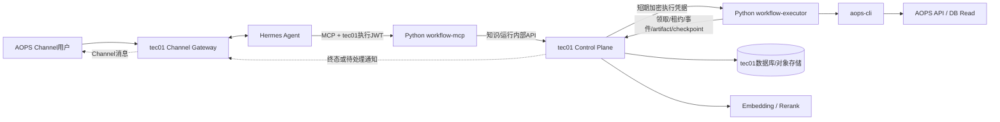
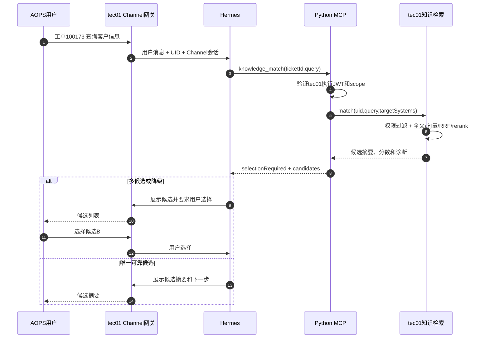
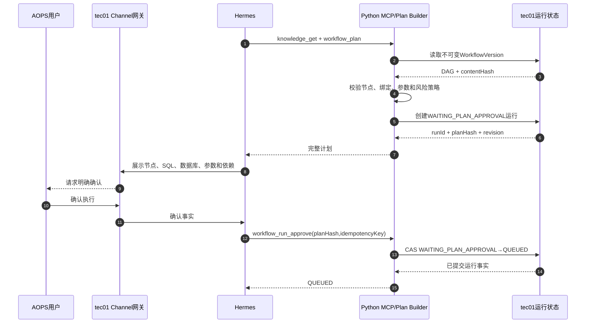
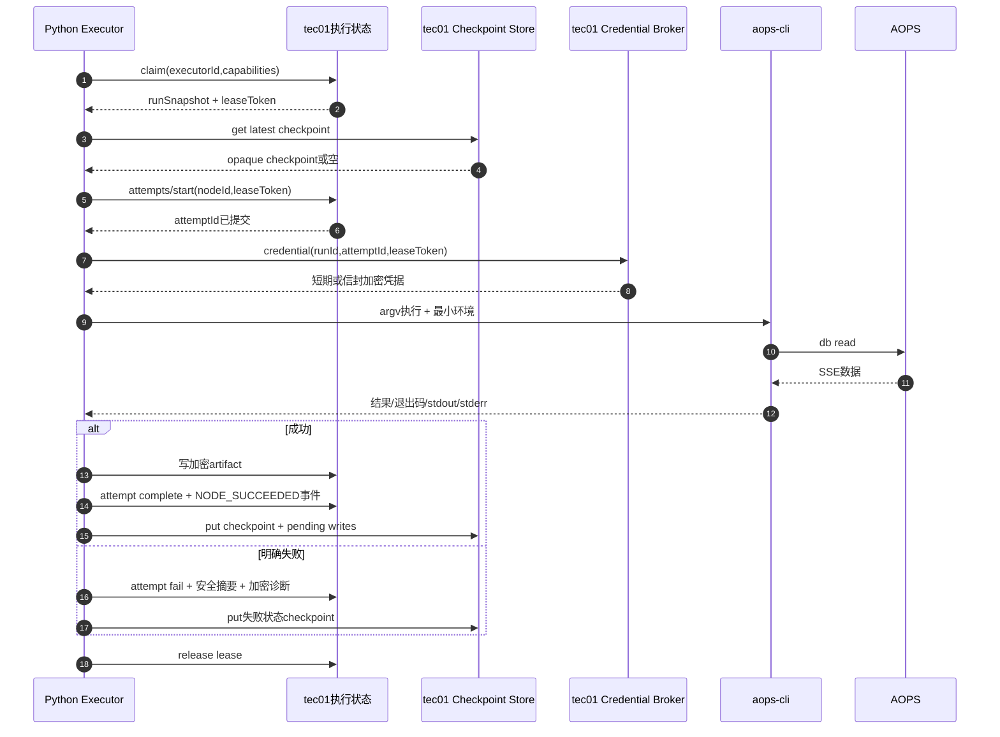
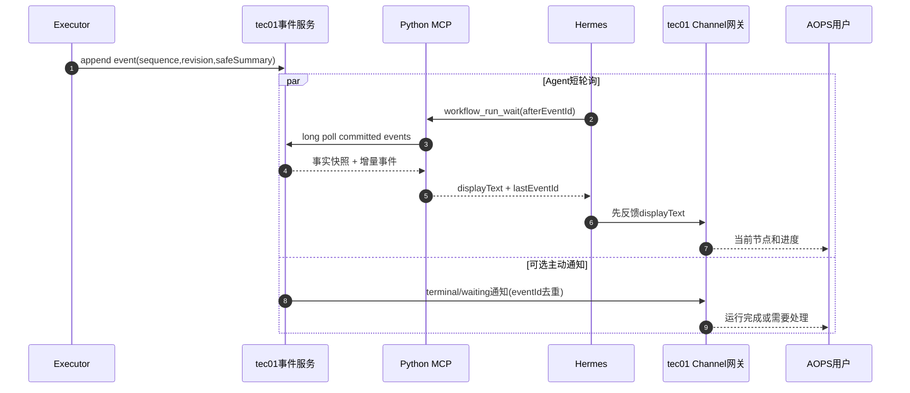
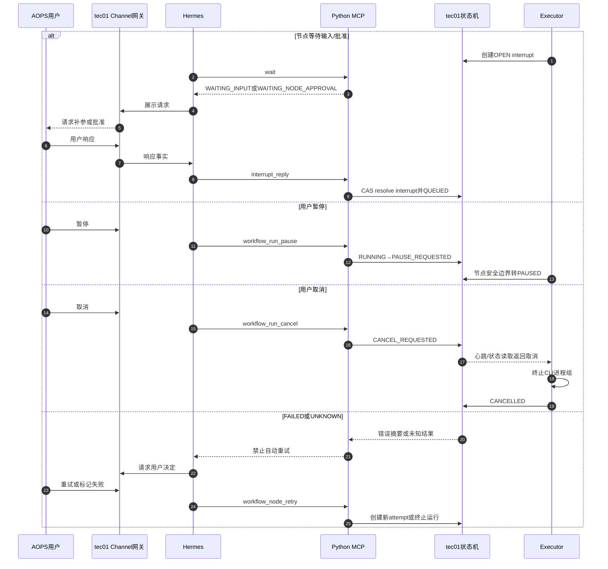
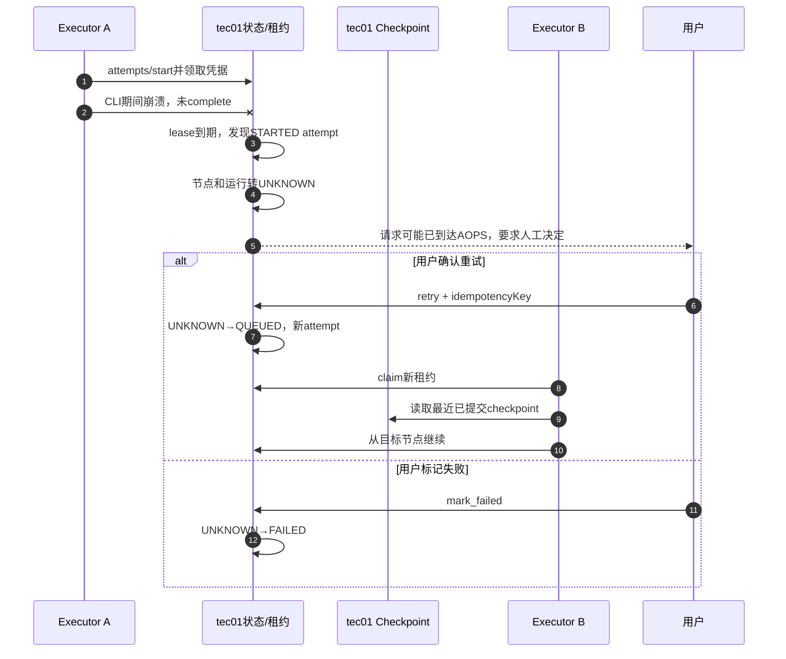
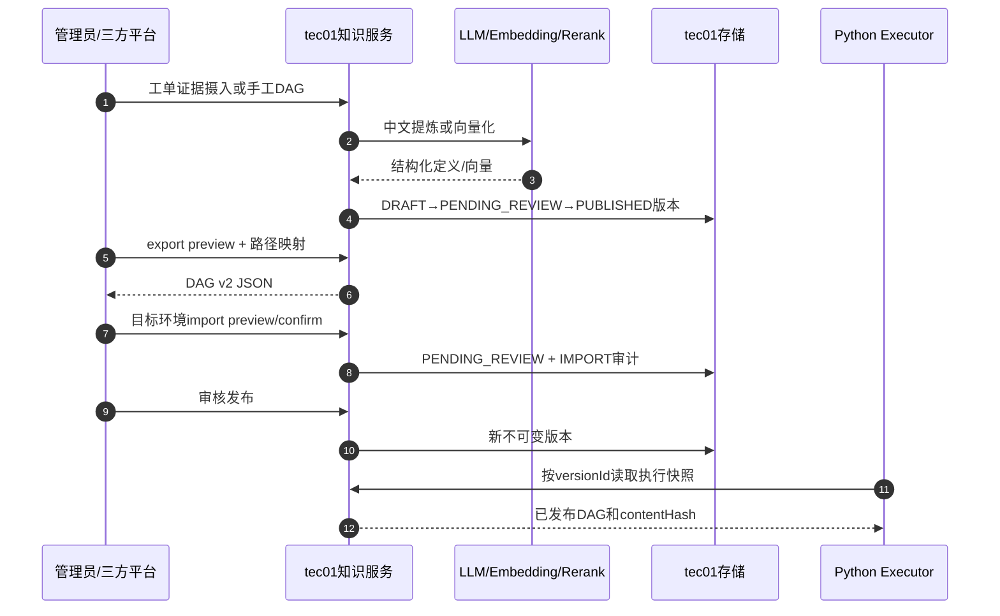

# tec01控制面与工作流执行面拆分设计

## 结论

可行，推荐将系统拆成：

- **tec01（Java控制面）**：同时承担 AOPS Channel网关、用户身份、知识管理与检索、工作流版本、运行状态、事件、审批、中断、凭据托管、artifact、checkpoint和审计存储。
- **itsm-workflow-executor（Python执行面）**：只承担 MCP工具、计划渲染与执行校验、LangGraph运行时、节点Handler、`aops-cli`进程控制及执行诊断，不再拥有业务数据库。

不能只迁移知识表而让执行端完全无状态。可恢复执行至少需要租约、attempt ledger、事件、artifact和 LangGraph checkpoint。若这些都交给 tec01，tec01必须提供具备事务、版本比较和幂等语义的内部存储 API；Python端需要实现基于该 API的远程 Checkpointer。

## 拆分后的职责

### tec01（Java）

| 模块 | 职责 |
|---|---|
| AOPS Channel Gateway | 接收用户在 AOPS Channel中的消息，维护会话和消息关联，把消息交给 Hermes，并把 Agent响应返回用户 |
| Identity & Policy | 将 Channel用户映射为UID；签发短期执行身份JWT；维护管理员、操作员、知识可见范围和执行权限 |
| Knowledge Service | 知识草稿、审核、发布、不可变版本、生命周期、授权UID、导入导出和路径映射 |
| Retrieval Service | 中文全文、BGE-M3向量召回、RRF、系统路由、排除短语和 rerank |
| Execution State Service | 运行、节点状态、revision、租约、attempt、审批、中断、幂等控制请求和状态机CAS |
| Event Service | 运行事件序列、长轮询/SSE、Channel通知去重和 `Last-Event-ID`语义 |
| Artifact & Checkpoint Store | 加密节点结果、诊断、LangGraph checkpoint和 pending writes；按保留策略清理 |
| Credential Broker | 托管用户 AOPS凭据，向指定执行实例签发短时、一次性或信封加密的执行凭据 |
| Admin/API | 管理页面和三方REST API；所有业务查询、分页和精确筛选统一从 tec01提供 |

### itsm-workflow-executor（Python）

建议保留两个进程，但作为同一个“执行面”部署单元：

| 进程/模块 | 职责 | 明确不做 |
|---|---|---|
| `workflow-mcp` | 暴露 MCP工具；验证 tec01签发的身份；调用 tec01知识与运行 API；生成 Agent需要的 `displayText`和下一步约束 | 不访问数据库、不保存知识、不直接修改运行状态 |
| `workflow-executor` | 从 tec01领取运行；校验不可变版本；驱动 LangGraph；执行节点；管理 CLI进程组；上报进度、结果和诊断 | 不对用户提供知识CRUD、不承担长期存储 |
| Plan Builder | 读取 tec01不可变工作流版本，检查节点、边、参数和风险策略，渲染安全执行计划与 `planHash` | 不猜测参数、不自动批准 |
| Remote Checkpointer | 实现 LangGraph `get_tuple/list/put/put_writes/delete_thread`，把序列化后的 opaque checkpoint交给 tec01 | 不在本地落盘 |
| Node Registry | `sql_read/condition/human_input/approval/end` Handler及未来操作类型 | 不允许数据库定义携带任意Python或Shell代码 |
| CLI Adapter | 使用参数数组启动 `aops-cli`、最小环境变量、超时、进程组取消、SSE解析和诊断脱敏 | 不使用Shell、不记录凭据 |

### Hermes

- Hermes仍负责理解用户描述、调用 MCP、展示候选和计划、获取明确确认、反馈进度及处理中断。
- Hermes不直接读写 tec01数据库，不直接调用 `aops-cli`，也不把历史对话当作运行事实。
- tec01作为 AOPS Channel网关负责消息接入；Hermes的 MCP连接由 tec01侧连接器注入短期身份头。

## 总体架构



拆分后不再需要当前 Python `itsm-workflow-api`承担业务REST和数据库访问。管理端迁移到 tec01；Python部署只保留 MCP、Executor、健康检查和指标端点。

## 身份与信任边界

### 推荐身份方式

tec01签发短期JWT，Hermes连接器将其作为固定 MCP Header注入：

```http
Authorization: Bearer <WORKFLOW_MCP_SERVICE_TOKEN>
X-TEC01-Execution-Token: <short-lived-jwt>
```

JWT至少包含：

```json
{
  "iss": "tec01",
  "aud": "itsm-workflow-executor",
  "sub": "S000639",
  "channelSessionId": "aops-session-xxx",
  "scopes": ["knowledge:match", "workflow:plan", "workflow:execute"],
  "jti": "unique-token-id",
  "exp": 1789000000
}
```

执行端通过 tec01 JWKS离线验签并校验 `iss/aud/exp/scopes`，避免每次 MCP wait重复请求 AOPS `/v2/user/self`。服务间调用同时使用 mTLS或内网服务身份，JWT只表达用户上下文，不能替代服务身份。

### AOPS执行凭据

不再把长期 `AOPS_API_KEY`作为 MCP工具参数或普通Header传给 Agent。推荐优先级：

1. AOPS支持短期委托Token时，由 tec01按运行签发。
2. 只能使用长期 API Key时，由 tec01 Credential Broker按 `runId + executorId + attemptId`生成一次性信封加密凭据。
3. Executor仅在内存解密并放入 `aops-cli`子进程环境，节点结束后立即清除。

凭据领取必须绑定租约Token，防止其他Executor读取。

## tec01必须提供的内部契约

### 知识与检索

```text
POST /internal/v1/knowledge/match
GET  /internal/v1/knowledge/{knowledgeId}
GET  /internal/v1/workflow-versions/{versionId}
```

匹配接口在 tec01内完成UID可见范围过滤、全文/向量召回和rerank。Executor读取版本时必须获得完整不可变 DAG及内容哈希。

### 计划与运行状态

```text
POST /internal/v1/runs
POST /internal/v1/runs/{runId}/transitions
GET  /internal/v1/runs/{runId}
GET  /internal/v1/runs/{runId}/wait
POST /internal/v1/runs/{runId}/events
POST /internal/v1/runs/{runId}/interrupts
POST /internal/v1/runs/{runId}/interrupts/{interruptId}/resolve
```

所有修改请求必须包含：

```json
{
  "idempotencyKey": "stable-request-key",
  "expectedRevision": 18,
  "actor": "S000639",
  "action": "APPROVE_PLAN"
}
```

tec01使用CAS更新 `revision`；版本冲突返回 `409 REVISION_CONFLICT`，Executor重新读取事实后决定下一步，不能覆盖新状态。

### Worker领取与租约

```text
POST /internal/v1/execution/claims
POST /internal/v1/execution/claims/{leaseToken}/heartbeat
POST /internal/v1/execution/claims/{leaseToken}/release
```

领取请求包含Executor ID、支持的节点类型和并发余量。响应返回 `runId`、不可变版本快照、运行输入和 `leaseToken`。所有 attempt、事件、checkpoint及凭据请求都必须携带该Token。

### Attempt与artifact

```text
POST /internal/v1/execution/runs/{runId}/attempts/start
POST /internal/v1/execution/runs/{runId}/attempts/{attemptId}/complete
POST /internal/v1/execution/runs/{runId}/attempts/{attemptId}/fail
PUT  /internal/v1/execution/runs/{runId}/artifacts/{artifactId}
GET  /internal/v1/execution/runs/{runId}/artifacts/{artifactId}
```

`attempts/start`必须在调用 CLI前事务提交。完成接口以 `attemptId`幂等；重复提交相同哈希返回原结果，不同哈希返回冲突。

### 远程 LangGraph Checkpointer

```text
GET    /internal/v1/checkpoints/{threadId}/latest
GET    /internal/v1/checkpoints/{threadId}
PUT    /internal/v1/checkpoints/{threadId}/{checkpointId}
POST   /internal/v1/checkpoints/{threadId}/{checkpointId}/writes
DELETE /internal/v1/checkpoints/{threadId}
```

tec01将 checkpoint和 pending writes作为不透明二进制或 Base64载荷保存，并按 `(threadId, checkpointNamespace, checkpointId)`唯一约束。Python端负责 LangGraph序列化和版本兼容，tec01不解析内部图状态。

## 关键流程泳道图

### 1. AOPS Channel消息、经验匹配与候选选择



### 2. 生成计划、用户确认与入队



### 3. Executor领取、执行节点与持久化



### 4. 进度反馈与 Channel主动通知



主动通知只用于终态或等待用户处理，不替代 Hermes的结构化 wait循环；tec01必须以 `eventId`去重，避免用户收到两份相同消息。

### 5. 人工输入、暂停、取消和失败重试



### 6. Executor崩溃、租约过期与恢复



tec01不能因租约到期直接把 `STARTED`节点重新排队，否则会重复产生 AOPS审计记录。

### 7. 知识生产、发布与跨环境迁移



## 状态一致性与失败规则

- **单写者**：运行状态只能由 tec01状态机写入；Executor通过命令API提交意图，不能覆盖整行状态。
- **乐观并发**：所有状态转换携带 `expectedRevision`，冲突后重新读取。
- **幂等**：用户控制请求、事件、attempt完成和artifact上传都需要稳定幂等键。
- **租约隔离**：写执行事实必须校验有效 `leaseToken`；旧Executor恢复后不能继续写入。
- **事件顺序**：每个运行由 tec01分配单调递增 `sequence`，Channel、Web和MCP共享同一游标。
- **外部调用边界**：`STARTED`必须早于 CLI调用提交；没有完成记录的租约过期节点只能进入 `UNKNOWN`。
- **不可变执行**：运行保存完整版本快照和内容哈希，知识后续编辑不影响已创建运行。
- **敏感数据**：凭据不进入 checkpoint、事件、日志或 MCP响应；artifact和诊断在 tec01加密保存并按期清理。

## 分阶段落地

### 阶段1：契约与身份

- tec01提供内部 OpenAPI、JWT/JWKS、mTLS和统一错误码。
- Python增加 `Tec01Client`接口，但保持现有 PostgreSQL实现作为兼容适配器。
- 建立契约测试，固定状态转换、revision、幂等和权限语义。

### 阶段2：知识与检索迁移

- 将知识、版本、UID可见范围、生命周期、向量和导入导出迁入 tec01。
- MCP的 `knowledge_match/knowledge_get`改为调用 tec01。
- 管理页面迁入 tec01；Python旧知识API改为只读代理后下线。

### 阶段3：新运行写入tec01

- 计划、审批、中断、事件、租约、attempt和artifact改由 tec01存储。
- 只允许新运行进入新链路；旧运行继续由原服务只读展示。
- 切换前排空 `RUNNING/WAITING_* /UNKNOWN`旧运行，不迁移活跃 checkpoint。

### 阶段4：远程Checkpointer与凭据Broker

- 实现并压测 Remote Checkpointer，覆盖 checkpoint list、pending writes和恢复。
- 接入一次性执行凭据和Executor实例身份。
- 故障注入验证 Worker崩溃、网络分区、重复complete、旧租约写入和tec01重启。

### 阶段5：执行面无数据库化

- 下线 Python业务API和本地 PostgreSQL依赖。
- 仅保留 `workflow-mcp`、`workflow-executor`、`/health`和`/metrics`。
- 旧库转为只读归档，完成保留期后下线。

## 验收标准

- Hermes通过 tec01 Channel收发消息，仍能完成匹配、选择、计划确认、执行、进度反馈和结果展示。
- Python执行面停止时不丢运行事实；恢复后从 tec01 checkpoint继续。
- tec01短暂不可用时Executor停止领取新任务，当前节点结果可重试上报但不能丢失或越过revision。
- Executor在 CLI期间崩溃后运行进入 `UNKNOWN`，不会自动重复执行。
- 用户可以从 AOPS Channel随时暂停、取消、补参、批准或决定失败节点重试。
- UID权限过滤在 tec01查询和分页前执行，未授权用户无法推断数量、知识或运行。
- PostgreSQL、tec01日志、Python日志、MCP参数和 checkpoint中都不存在明文 AOPS API Key。
- DAG v2导入导出、历史版本、生命周期、运行事件和迁移审计在新控制面保持等价。
- 执行端删除数据库配置后仍能完成全流程，证明没有隐藏的本地持久化依赖。

## 推荐决策

采用“**tec01强一致控制面 + Python无业务存储执行面**”，而不是让 Python直接连接 tec01数据库。直接共享数据库虽然改造快，但会把Java表结构、Python ORM和LangGraph checkpoint紧耦合，无法形成稳定服务边界。Remote Checkpointer和租约/attempt API是本次拆分成本最高的部分，应先做契约和故障注入验证，再迁移生产运行。
