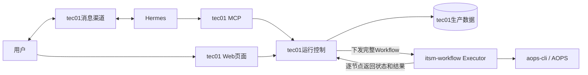
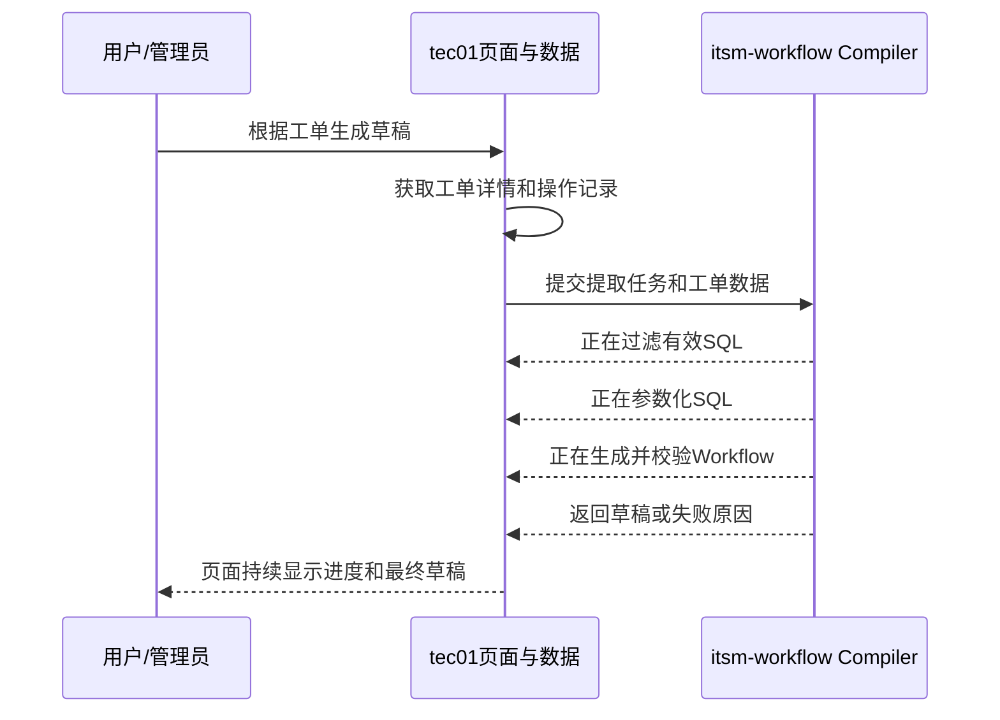
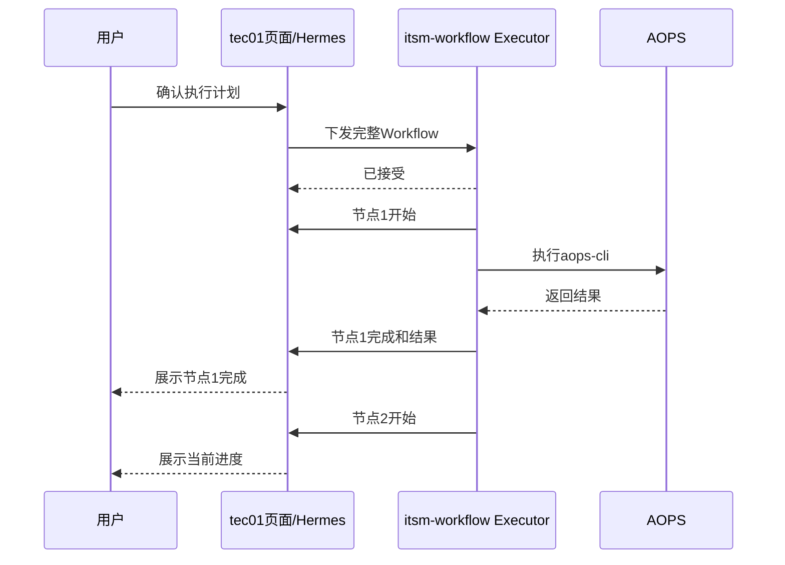
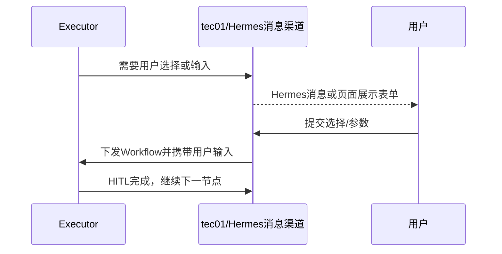
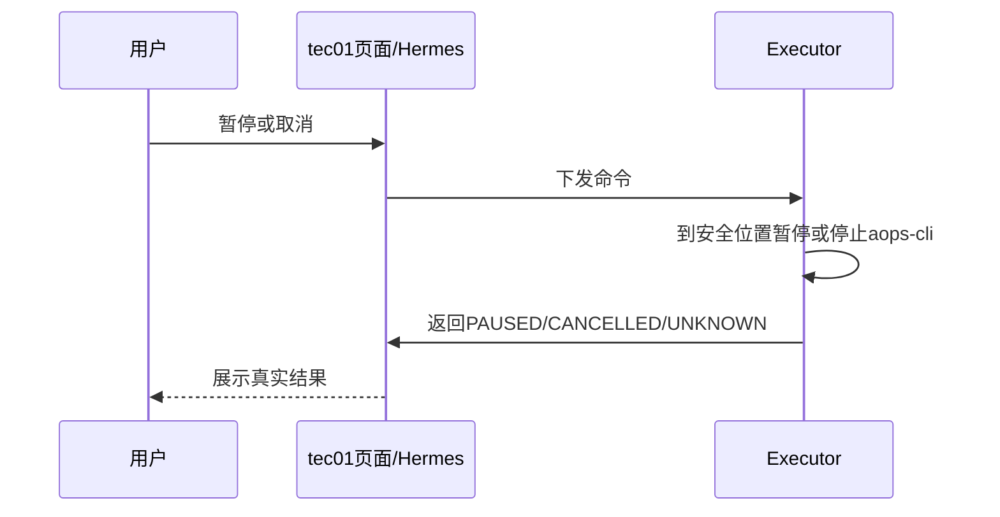

# tec01与itsm-workflow拆分设计

## 结论

采用简单的两层架构：

- **tec01**：用户消息渠道、Hermes接入、MCP、知识管理、计划与运行状态、页面和生产数据。
- **itsm-workflow**：Node Registry、草稿提取、Workflow校验、节点执行和`aops-cli`适配。

tec01主动把完整Workflow下发给Executor。Executor按tec01给出的节点状态继续执行，并把每个节点的开始、结果、失败或等待状态返回tec01。

## 总体结构



用户无论从Hermes消息渠道还是tec01页面操作，最终都进入同一个tec01运行控制接口。Executor不直接向用户发送消息。

## 职责

### tec01

- 通过AOPS Channel与用户交互，并承载Hermes和MCP。
- 保存知识、Workflow版本、执行计划和全部运行状态。
- 向用户展示计划、节点进度、结果、失败原因和HITL表单。
- 用户确认后主动向Executor下发完整Workflow。
- 主动下发暂停和取消命令。
- 保存每个节点返回的状态和结果。

### itsm-workflow

- 管理节点类型、Schema和Handler。
- 根据工单详情和操作记录生成Workflow草稿。
- 校验Workflow和生成可展示计划。
- 接收tec01下发的完整Workflow并执行。
- 调用真实`aops-cli`，解析SSE结果。
- 生成条件判断、HITL候选和HITL表单。
- 每个节点结束后立即把状态和结果返回tec01。

## 草稿提取

tec01取得工单详情和操作记录后，主动调用Compiler。Compiler不再自行拉取任务，也不主动访问AOPS。



提取进度由Compiler回调tec01。tec01保存进度，再通过页面SSE或Hermes消息展示。Compiler不直接连接浏览器。

建议进度保持简单：

```text
已接收
正在过滤操作记录
正在生成步骤和参数
正在校验Workflow
已完成 / 失败
```

## 生产执行

tec01下发：

- 完整不可变Workflow。
- 工单ID和运行参数。
- 每个节点当前状态。
- 已完成节点的结果引用。
- 需要恢复的HITL输入。

Executor返回`202 Accepted`后在后台执行，不占用tec01的HTTP请求。



Executor每完成一个节点就回报，不等整个Workflow结束后再一次性返回。

## 执行一半后恢复

完整Workflow可以已经执行了一部分。tec01再次下发时同时提供节点状态：

```text
SUCCEEDED  已完成，Executor跳过
SKIPPED    未命中分支，Executor跳过
READY      下一步可以执行
PENDING    等待前置节点
WAITING    等待用户输入
FAILED     等待用户决定是否重试
```

Executor只从`READY`节点继续，不重复执行`SUCCEEDED`节点。完整计划可以缓存在Executor内存，但tec01保存的Workflow、节点状态和结果才是最终事实。

## HITL节点

运行时不使用LLM节点。人工交互分成两种：

- `hitl_select`：从前置SQL结果中选择一条或多条。
- `hitl_form`：用户手工填写一个或多个参数。

### 从SQL结果选择

SQL可以返回很多字段，但HITL只展示Workflow配置允许的字段：

```json
{
  "sourceNodeId": "sql-1",
  "sourcePath": "/data",
  "idPath": "/customer_id",
  "labelTemplate": "{{customer_name}} / {{customer_id}}",
  "displayFields": ["customer_name", "customer_id", "status"],
  "outputFields": ["customer_id", "account_id"]
}
```

用户看到姓名、编号和状态；选择后，下游只得到配置的`customer_id`和`account_id`。Agent提交`candidateId`，不能直接修改候选真实值。

候选很多时，tec01页面和MCP分页显示并支持关键词筛选。

### 用户手工输入

```json
{
  "type": "hitl_form",
  "config": {
    "title": "填写后续查询参数",
    "fields": [
      {"name":"customer_id","label":"客户编号","type":"string","required":true},
      {"name":"limit","label":"返回条数","type":"integer","required":true,"minimum":1,"maximum":100}
    ]
  }
}
```

用户可以在Hermes对话或tec01页面填写。两种入口使用同一个tec01接口，提交后重新下发Workflow继续执行。

### HITL泳道图



等待用户期间Executor释放该运行，不占用执行槽位。

## 暂停、取消和失败

tec01主动向当前Executor发送命令：



- 暂停：当前节点到达安全位置后保存状态并释放运行。
- 取消：停止本地进程；如果请求可能已经到达AOPS，返回`UNKNOWN`。
- 失败：返回失败原因并释放运行，等待用户决定是否重试。
- 完成：返回最终结果并释放运行。

## 页面设计

tec01生产页面至少包含：

1. **执行计划**：节点卡片、数据库、SQL摘要、参数来源和风险说明。
2. **执行进度**：当前节点、已完成节点、失败原因和每步结果入口。
3. **HITL面板**：候选分页、字段表单、确认和取消。
4. **运行控制**：暂停、继续、取消和失败重试。
5. **消息同步**：Hermes中的状态与页面一致，用户可以在任一入口继续处理。

itsm-workflow Studio只用于Node管理、草稿预览和真实调试，不承担生产运行页面。

## 当前规模的约束

- 第一版只有一个Executor服务，最多处理几十个并发运行。
- Executor设置最大运行数和最大`aops-cli`进程数，满载时返回“暂时无容量”，tec01稍后重试。
- 使用`dispatchId`防止tec01重复下发同一运行。
- 每个节点必须先回报tec01，再执行下一个节点。
- AOPS API Key不放进Workflow；Executor按当前运行临时获取并只传给`aops-cli`。
