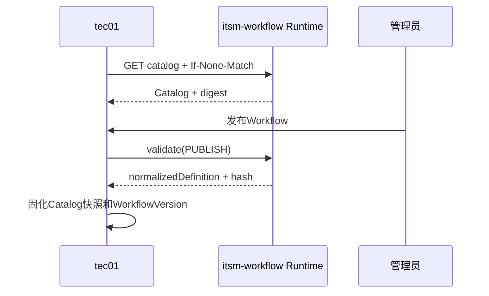
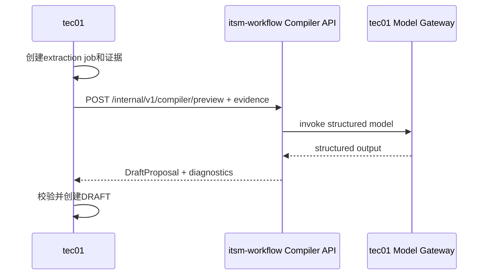
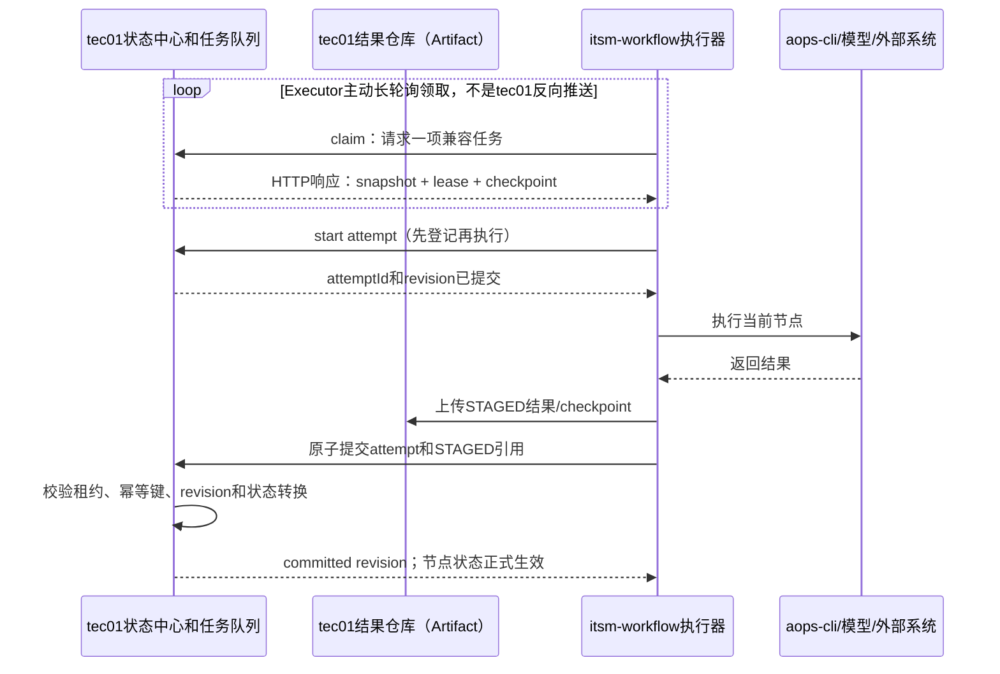
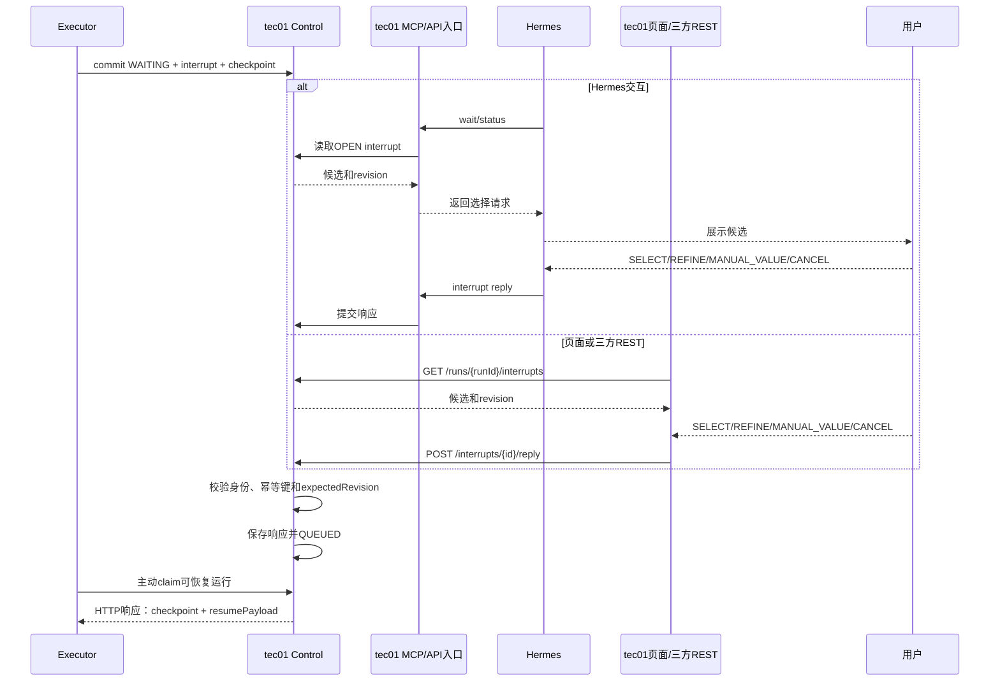
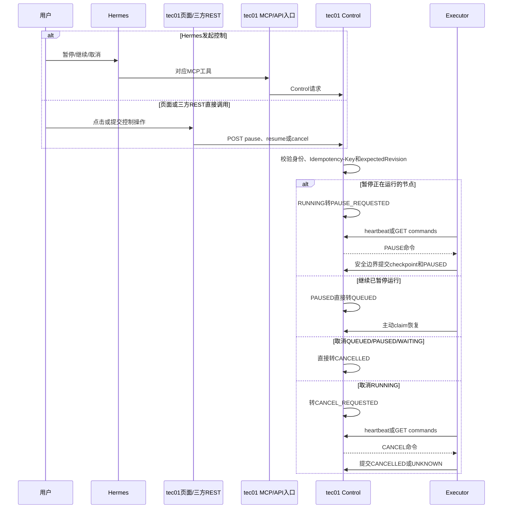

# tec01与itsm-workflow并行开发集成契约

## 文档目的

本文冻结tec01和itsm-workflow第一版内部交互边界，供Java与Python团队并行开发。正式实现应从本文生成OpenAPI、JSON Schema和双方契约测试；任何不兼容调整必须先更新契约版本。

## 服务边界

| 能力 | 提供方 | 调用方 |
|---|---|---|
| AOPS Channel、Hermes MCP | tec01 | Hermes/用户 |
| 生产知识、版本、运行和审计 | tec01 | MCP、管理端、itsm-workflow |
| Node Catalog | itsm-workflow | tec01、Studio |
| Workflow校验和计划渲染 | itsm-workflow | tec01 |
| Workflow草稿编译 | itsm-workflow Runtime Compiler API | tec01同步调用 |
| 生产节点执行 | itsm-workflow Executor Worker | tec01任务队列 |
| 生产artifact/checkpoint | tec01 | itsm-workflow、tec01 MCP/UI |
| Studio临时测试 | itsm-workflow Studio + SQLite | 开发/管理员 |
| 模型Profile、凭据和调用审计 | tec01 Model Gateway | Compiler/Executor |

itsm-workflow不直连tec01数据库；tec01不加载Python Handler代码。

## 网络与认证

### 基础地址

示例：

```text
tec01 internal:          https://tec01.internal
itsm-workflow internal:  https://workflow-runtime.internal
```

双方内部接口只允许内网服务身份访问，不通过公网或用户浏览器直接调用。

### 双重服务认证

推荐同时使用：

1. mTLS验证调用服务实例。
2. OAuth2 client credentials或平台签发的短期服务JWT。

JWT要求：

```text
iss     内网统一身份服务
sub     tec01-service / itsm-workflow-runtime
aud     对端服务标识
scope   精确接口权限
exp     不超过15分钟
jti     唯一Token ID
```

tec01调用itsm-workflow时`aud=itsm-workflow-runtime`；itsm-workflow调用tec01时`aud=tec01-internal`。

需要表达最终用户时，tec01额外签发短期委托JWT：

```http
X-TEC01-Actor-Token: <signed-jwt>
```

包含`sub=uid`、Channel会话、权限scope和过期时间。itsm-workflow只验证和记录actor，不使用该Token访问AOPS。

### 公共Header

```http
Authorization: Bearer <service-token>
X-Request-Id: <uuid>
traceparent: <W3C trace context>
Idempotency-Key: <mutation request stable key>
Content-Type: application/json
```

规则：

- `X-Request-Id`缺失时接收方生成并在响应返回。
- 所有修改接口要求`Idempotency-Key`，最长120字符。
- 时间统一使用UTC ISO 8601。
- JSON字段统一camelCase。
- ID视为不透明字符串，调用方不能解析前缀推导业务。

## 公共响应和错误

成功响应直接返回业务JSON。异步领取无任务返回`204 No Content`。

错误统一为：

```json
{
  "code": "STATE_REVISION_CONFLICT",
  "message": "运行状态已变化，请重新读取",
  "requestId": "req_xxx",
  "retryable": true,
  "details": {
    "expectedRevision": 18,
    "actualRevision": 19
  }
}
```

HTTP映射：

| HTTP | 场景 |
|---:|---|
| 400 | JSON或业务参数无效 |
| 401 | 服务Token或委托Token无效 |
| 403 | scope、UID或资源权限不足 |
| 404 | 资源不存在或为防越权隐藏 |
| 409 | revision、幂等、租约或状态冲突 |
| 413 | evidence、artifact或checkpoint超过限制 |
| 422 | Workflow/Node Schema校验失败 |
| 429 | 并发、配额或模型限流 |
| 503 | 对端依赖不可用 |

稳定错误码至少包括：

```text
INVALID_REQUEST
UNAUTHORIZED_SERVICE
ACTOR_FORBIDDEN
RESOURCE_NOT_FOUND
IDEMPOTENCY_CONFLICT
STATE_REVISION_CONFLICT
LEASE_EXPIRED
NODE_TYPE_UNSUPPORTED
NODE_VERSION_UNSUPPORTED
WORKFLOW_VALIDATION_FAILED
PAYLOAD_TOO_LARGE
CREDENTIAL_UNAVAILABLE
MODEL_UNAVAILABLE
MODEL_OUTPUT_INVALID
REFINEMENT_LIMIT_REACHED
```

## Catalog同步：itsm-workflow提供

### 获取Catalog

```http
GET /internal/v1/runtime/catalog
If-None-Match: "<catalogDigest>"
```

响应：

```json
{
  "protocolVersion": 1,
  "runtimeVersion": "1.0.0",
  "catalogVersion": "2026-09-20.1",
  "catalogDigest": "sha256...",
  "generatedAt": "2026-09-20T03:00:00Z",
  "nodes": [
    {
      "type": "llm_extract",
      "schemaVersion": 1,
      "handlerVersion": "1.0.0",
      "display": {
        "name": "LLM结构化提取",
        "category": "transform",
        "description": "将前置结果提取为结构化候选"
      },
      "riskLevel": "LOW",
      "approvalPolicy": "PLAN",
      "idempotencyClass": "REPLAY_WITH_STORED_RESULT",
      "resumeSemantics": "CHECK_RESULT_THEN_RETRY",
      "supportedModes": ["PRODUCTION","TEST","SIMULATION","DRY_RUN"],
      "configSchema": {},
      "inputSchema": {},
      "outputSchema": {},
      "uiSchema": {},
      "schemaDigest": "sha256..."
    }
  ]
}
```

tec01行为：

- 启动时拉取，之后每60秒带ETag检查。
- `304 Not Modified`不更新缓存。
- 新Catalog先验证Schema与摘要，再标记可用。
- Runtime不可用时可读取已缓存Catalog展示旧版本，但禁止发布需要重新校验的新工作流。
- Catalog变更不自动修改已发布WorkflowVersion。

## Workflow校验和计划：itsm-workflow提供

### 校验Workflow

```http
POST /internal/v1/runtime/workflows/validate
```

```json
{
  "workflowDefinition": {},
  "targetCatalogDigest": "sha256...",
  "validationMode": "PUBLISH"
}
```

`validationMode`：`DRAFT/PUBLISH/EXECUTE/TEST`。

响应：

```json
{
  "valid": true,
  "normalizedDefinition": {},
  "catalogDigest": "sha256...",
  "workflowContentHash": "sha256...",
  "requiredRuntimeVersion": ">=1.0.0,<2.0.0",
  "warnings": []
}
```

错误`422 WORKFLOW_VALIDATION_FAILED`返回字段路径、节点ID和可读原因。

### 渲染计划

```http
POST /internal/v1/runtime/workflows/plan
```

```json
{
  "workflowVersionId": "wfv_xxx",
  "workflowContentHash": "sha256...",
  "workflowSnapshot": {},
  "ticketId": 100173,
  "parameters": {"customerName":"王五"},
  "actorUid": "S000639"
}
```

响应：

```json
{
  "valid": true,
  "renderedPlan": {
    "nodes": [],
    "edges": [],
    "riskSummary": [],
    "requiredInputs": []
  },
  "planMaterialHash": "sha256...",
  "catalogDigest": "sha256...",
  "runtimeVersion": "1.0.0"
}
```

最终`planHash`由tec01计算：

```text
SHA-256 RFC8785-JCS(
  workflowVersionId,
  workflowContentHash,
  ticketId,
  normalized parameters,
  planMaterialHash
)
```

tec01保存上述材料并创建`WAITING_PLAN_APPROVAL`，批准时必须回传相同planHash。

## 草稿同步编译：tec01调用Runtime

正式草稿生产不使用Compiler claim、租约或独立Worker。tec01获取`ticketInfo`与`auditTimeline`并保存PROCESSING记录，然后同步调用：

```http
POST /internal/v1/compiler/preview
Authorization: Bearer <RUNTIME_SERVICE_TOKEN>
Content-Type: application/json
```

```json
{
  "ticketInfo": {},
  "auditTimeline": [],
  "targetCatalogDigest": "sha256..."
}
```

成功响应直接包含`compilerVersion`、`catalogDigest`、`proposal`和`diagnostics`。tec01在调用前按`ticketId + evidenceHash + compilerVersion + promptVersion`去重，并在响应后校验Catalog、创建DRAFT及把提取记录标记为SUCCEEDED。当前Runtime接口本身无生产状态，不保存幂等记录。默认连接超时5秒、总超时120至180秒。

## Executor注册与任务领取：tec01提供

### 注册Executor

```http
POST /internal/v1/executors
```

```json
{
  "executorId": "runtime-t1361-01",
  "runtimeVersion": "1.0.0",
  "protocolVersion": 1,
  "maxConcurrency": 12,
  "supportedCatalogDigests": ["sha256..."],
  "credentialEncryptionJwk": {
    "kty": "RSA",
    "kid": "runtime-t1361-01-20260920",
    "alg": "RSA-OAEP-256",
    "use": "enc",
    "n": "...",
    "e": "AQAB"
  }
}
```

tec01返回注册ID和心跳策略。JWK仅用于加密短期凭据，私钥只存在Executor内存或受保护本地密钥库。

### 领取运行

```http
POST /internal/v1/execution/claims
```

```json
{
  "executorId": "runtime-t1361-01",
  "runtimeVersion": "1.0.0",
  "availableSlots": 7,
  "waitSeconds": 15
}
```

响应：

```json
{
  "runId": "run_xxx",
  "leaseToken": "opaque",
  "leaseExpiresAt": "2026-09-20T03:01:00Z",
  "revision": 18,
  "workflowVersionId": "wfv_xxx",
  "workflowContentHash": "sha256...",
  "catalogDigest": "sha256...",
  "workflowSnapshot": {},
  "runInputs": {},
  "nodeStatuses": {},
  "outputRefs": {},
  "checkpoint": {
    "checkpointId": "cp_xxx",
    "checkpointFormatVersion": 1,
    "runtimeVersion": "1.0.0",
    "contentBase64": "..."
  },
  "resumePayload": null
}
```

只分配Runtime兼容的运行。无任务返回204。

### 运行心跳与控制命令

```http
POST /internal/v1/execution/claims/{leaseToken}/heartbeat
```

```json
{
  "executorId": "runtime-t1361-01",
  "runId": "run_xxx",
  "observedRevision": 18,
  "activeAttemptId": "att_xxx"
}
```

响应：

```json
{
  "leaseExpiresAt": "2026-09-20T03:01:20Z",
  "revision": 19,
  "commands": [
    {"commandId":"cmd_xxx","type":"CANCEL","createdAt":"2026-09-20T03:00:20Z"}
  ]
}
```

支持命令：`PAUSE_AT_SAFE_POINT/CANCEL/CREDENTIAL_REVOKED`。命令确认：

```http
POST /internal/v1/execution/claims/{leaseToken}/commands/{commandId}/ack
```

释放租约：

```http
POST /internal/v1/execution/claims/{leaseToken}/release
```

## Attempt与原子状态提交：tec01提供

### 创建STARTED attempt

```http
POST /internal/v1/runs/{runId}/attempts
```

```json
{
  "leaseToken": "opaque",
  "expectedRevision": 18,
  "idempotencyKey": "run_xxx:sql-read:1",
  "nodeId": "sql-read",
  "nodeType": "sql_read",
  "schemaVersion": 1,
  "handlerVersion": "1.0.0",
  "commandSummary": "db read on crm-read"
}
```

响应`attemptId/revision/startedAt`。该响应成功后Executor才能调用外部系统。

### 上传STAGED artifact

创建元数据：

```http
POST /internal/v1/runs/{runId}/staged-artifacts
```

```json
{
  "leaseToken": "opaque",
  "attemptId": "att_xxx",
  "artifactType": "NODE_RESULT",
  "sensitivity": "BUSINESS_DATA",
  "contentType": "application/json",
  "contentLength": 10240,
  "contentSha256": "sha256...",
  "expiresAt": "2026-10-20T03:00:00Z"
}
```

返回`uploadId`。上传内容：

```http
PUT /internal/v1/runs/{runId}/staged-artifacts/{uploadId}/content
Content-Type: application/octet-stream
X-Content-SHA256: <sha256>
X-Lease-Token: <leaseToken>
```

第一版单artifact最大20 MiB；以后切对象存储时保持元数据和commit协议不变，只把上传响应扩展为presigned URL。

### 上传STAGED checkpoint

```http
PUT /internal/v1/runs/{runId}/staged-checkpoints/{checkpointId}
```

```json
{
  "leaseToken": "opaque",
  "attemptId": "att_xxx",
  "runtimeVersion": "1.0.0",
  "checkpointFormatVersion": 1,
  "checkpointNamespace": "",
  "parentCheckpointId": "cp_parent",
  "contentBase64": "...",
  "contentSha256": "sha256...",
  "pendingWrites": []
}
```

只有COMMITTED checkpoint可通过claim恢复。

Remote Checkpointer读取和清理接口：

```text
GET    /internal/v1/checkpoints/{threadId}/latest
GET    /internal/v1/checkpoints/{threadId}
DELETE /internal/v1/checkpoints/{threadId}
```

`latest`支持`checkpointId`和`checkpointNamespace`查询参数；无记录返回204。列表支持`before/limit`，只返回COMMITTED checkpoint并保留parent chain。DELETE仅用于终态保留期清理，不能删除活跃运行依赖的祖先checkpoint。

LangGraph pending writes追加接口：

```http
POST /internal/v1/runs/{runId}/staged-checkpoints/{checkpointId}/writes
```

要求相同leaseToken、attemptId和checkpointFormatVersion；以`taskId + writeIndex`幂等。

### 原子commit

```http
POST /internal/v1/runs/{runId}/attempts/{attemptId}/commit
```

```json
{
  "leaseToken": "opaque",
  "expectedRevision": 19,
  "idempotencyKey": "attempt:att_xxx:commit",
  "requestHash": "sha256...",
  "attemptStatus": "SUCCEEDED",
  "nodeTransition": {
    "nodeId": "sql-read",
    "from": "RUNNING",
    "to": "SUCCEEDED"
  },
  "artifactUploads": [
    {"uploadId":"upl_xxx","role":"NODE_RESULT","contentSha256":"sha256..."}
  ],
  "checkpointId": "cp_xxx",
  "outputRef": {"nodeId":"sql-read","artifactUploadId":"upl_xxx"},
  "event": {
    "type": "NODE_SUCCEEDED",
    "safeSummary": "查询返回2行"
  },
  "runTransition": null,
  "interrupt": null
}
```

tec01在一个事务中验证并提交全部状态。`attemptStatus`也支持`FAILED/CANCELLED/UNKNOWN/WAITING`。WAITING时必须带interrupt，runTransition为对应等待状态。

### 长节点进度事件

```http
POST /internal/v1/runs/{runId}/attempts/{attemptId}/events
```

只允许安全摘要和数值进度，不改变状态；要求幂等键，tec01分配事件sequence。

## Artifact读取与凭据：tec01提供

下游节点读取前置结果：

```http
GET /internal/v1/runs/{runId}/artifacts/{artifactId}
X-Lease-Token: <leaseToken>
```

tec01验证当前租约、运行和节点依赖后返回内容。支持HTTP Range作为后续扩展，第一版完整返回且不超过20 MiB。

领取执行凭据：

```http
POST /internal/v1/execution/claims/{leaseToken}/credentials
```

```json
{
  "runId": "run_xxx",
  "attemptId": "att_xxx",
  "credentialType": "AOPS_API_KEY",
  "executorId": "runtime-t1361-01"
}
```

返回JWE compact serialization，使用注册Executor的RSA公钥，算法固定`RSA-OAEP-256 + A256GCM`，包含`expiresAt`和`oneTime=true`。Executor只在内存解密，不写checkpoint、日志或artifact。

## Model Gateway：tec01提供

```http
POST /internal/v1/model/invoke
```

```json
{
  "idempotencyKey": "run:node:iteration:inputHash",
  "modelProfileId": "internal-structured-medium",
  "promptTemplateId": "extract-customer-v3",
  "promptTemplateVersion": 3,
  "inputs": {},
  "responseSchema": {},
  "dataPolicy": "CUSTOMER_QUERY_INTERNAL",
  "timeoutSeconds": 90
}
```

tec01管理模型URL、凭据、限流和审计。响应包含结构化output、modelVersion、promptVersion、inputHash和responseHash。相同幂等键返回原响应。

## HITL与恢复

Hermes、tec01 Web UI和三方系统共享以下用户控制接口；MCP工具只是这些接口的Agent适配层：

```text
POST /api/v1/runs/{runId}/pause
POST /api/v1/runs/{runId}/resume
POST /api/v1/runs/{runId}/cancel
POST /api/v1/runs/{runId}/interrupts/{interruptId}/reply
POST /api/v1/runs/{runId}/nodes/{nodeId}/retry
```

每个写请求都要求用户或服务身份、`Idempotency-Key`和请求体中的`expectedRevision`。普通用户只能操作自己有权访问的运行；服务身份必须携带受限scope和最终操作者信息。所有入口共用tec01 Control的权限、幂等和状态转换表，不允许直接调用Executor。

Executor在attempt commit中携带interrupt：

```json
{
  "kind": "HITL_SELECT",
  "interactionSessionId": "intsession_xxx",
  "iteration": 1,
  "maxIterations": 3,
  "title": "请选择客户",
  "actions": ["SELECT","REFINE","MANUAL_VALUE","CANCEL"],
  "optionsArtifactUploadId": "upl_options",
  "valueSchema": {"type":"string"}
}
```

tec01 MCP、tec01 Web UI或三方REST都可以接收用户回复，但必须调用同一个tec01 Control接口保存：

```text
interrupt status: OPEN → RESOLVED
run status: WAITING_INPUT → QUEUED
resumePayload: action + candidateId/feedback/value
revision increment
```

新claim携带resumePayload，Executor恢复checkpoint。

`REFINE`时tec01校验iteration未超限；Executor重新运行声明的上游LLM节点并创建新attempt和新interrupt。旧interrupt回复返回409。

## Studio草稿提升：tec01提供

```http
POST /internal/v1/knowledge/draft-proposals
X-TEC01-Actor-Token: <delegated actor jwt>
```

```json
{
  "idempotencyKey": "studio:test_draft_xxx:promote",
  "source": "ITSM_WORKFLOW_STUDIO",
  "studioDraftId": "test_draft_xxx",
  "catalogDigest": "sha256...",
  "creatorUid": "S000639",
  "uids": [],
  "name": "客户信息查询",
  "summary": "根据工单条件查询客户信息",
  "matchPhrases": ["客户信息查询"],
  "negativePhrases": [],
  "systemKeys": ["crm"],
  "workflowDefinition": {},
  "sourceEvidenceHash": "sha256..."
}
```

tec01重新校验actor、Catalog和Workflow，始终创建`DRAFT`，不能通过该接口直接发布。

## 状态机

运行状态：

```text
WAITING_PLAN_APPROVAL
QUEUED
RUNNING
PAUSE_REQUESTED
PAUSED
WAITING_INPUT
WAITING_NODE_APPROVAL
WAITING_CREDENTIAL
SUCCEEDED
FAILED
CANCEL_REQUESTED
CANCELLED
UNKNOWN
```

节点状态：

```text
PENDING
READY
RUNNING
WAITING
SUCCEEDED
FAILED
SKIPPED
CANCELLED
UNKNOWN
```

tec01拥有合法转换表。Executor只提交建议转换，不能直接覆盖状态。

## 关键交互泳道图

### Catalog与发布



### 草稿编译



### 生产执行



箭头`T-->>E`均为Executor发起的HTTP请求响应。第一版不要求tec01能访问Executor，也不使用WebSocket向Executor下发节点。暂停和取消命令同样由Executor通过心跳响应或`GET commands`主动取得。

未来可以增加可选的`RUN_AVAILABLE/CONTROL_AVAILABLE`消息通知来降低领取延迟，但通知只负责唤醒Executor。Executor收到通知后仍必须调用claim或commands接口取得权威任务、租约和控制命令；消息本身不得携带明文凭据、不得直接创建attempt，也不得改变运行状态。这样消息重复、乱序或丢失时不会产生第二套事实源。

### HITL恢复



### 暂停、继续与取消



Hermes、Web UI和三方REST不得分别实现状态转换；它们只是同一Control API的不同适配入口。并发写入通过revision CAS处理，旧`expectedRevision`统一返回`409 STATE_REVISION_CONFLICT`。

## 超时、重试和限流

| 调用 | 超时 | 自动重试 |
|---|---:|---|
| Catalog GET | 5秒 | 指数退避，使用已验证缓存 |
| Validate/Plan | 10秒 | 仅相同请求哈希重试 |
| Compiler同步调用 | 120至180秒 | tec01按相同evidenceHash复用成功结果并有限重试 |
| Executor claim | 最长20秒长轮询 | 连接失败后退避 |
| Heartbeat | 5秒 | 租约有效期内重试 |
| Artifact上传 | 60秒 | 按uploadId和哈希重试 |
| Attempt commit | 10秒 | 必须使用相同幂等键查询原结果 |
| Model invoke | 最大180秒 | 由Model Gateway按幂等键控制 |

双方时钟允许最大30秒偏差。tec01是租约到期时间的权威来源。

## 版本兼容

- URL主版本为`/internal/v1`。
- 新增可选字段属于兼容修改。
- 删除字段、改变含义或收紧枚举需要v2。
- 请求包含未知可选字段时服务端忽略；未知枚举必须拒绝。
- Catalog声明`protocolVersion`，tec01只调度支持版本。
- WorkflowVersion固定catalogDigest和节点schemaVersion。
- Checkpoint固定runtimeVersion和checkpointFormatVersion。

至少提前两个发布版本标记接口或字段Deprecated。

## 安全要求

- mTLS和服务JWT必须同时通过。
- Actor Token不能替代服务身份。
- 所有日志过滤Authorization、JWE、API Key、SQL结果和用户手工值。
- artifact/checkpoint在tec01加密存储。
- Compiler/Executor响应不得回传完整原始凭据。
- tec01校验leaseToken与run/attempt绑定。
- Runtime只允许访问其租约覆盖的artifact和credential。
- Studio Token不具备生产attempt、lease或credential scope。

## 联调与契约测试

双方共同维护：

```text
contracts/openapi/tec01-internal-v1.yaml
contracts/openapi/runtime-internal-v1.yaml
contracts/jsonschema/node-catalog.schema.json
contracts/jsonschema/workflow-v2.schema.json
contracts/jsonschema/draft-proposal.schema.json
contracts/jsonschema/attempt-commit.schema.json
contracts/examples/
```

tec01提供Mock Server覆盖：

- 无任务204。
- 租约续期和过期。
- revision冲突。
- 幂等重复与冲突。
- STAGED上传、commit和TTL清理。
- interrupt回复及旧回复冲突。
- Credential JWE。

itsm-workflow提供Mock Server覆盖：

- Catalog 200/304。
- Workflow校验成功和字段错误。
- Plan渲染。
- Compiler成功、无有效操作、LLM失败。

双方CI执行Provider和Consumer契约测试。任何Schema示例必须能通过对应JSON Schema。

## 联调验收顺序

1. 服务认证、Request ID和统一错误。
2. Catalog同步和Workflow validate。
3. Plan渲染和planHash样例对齐。
4. Compiler同步preview、超时和幂等结果。
5. Executor register/claim/heartbeat。
6. Attempt STARTED。
7. STAGED artifact/checkpoint和原子commit。
8. PAUSE/CANCEL命令。
9. HITL SELECT/MANUAL_VALUE/CANCEL。
10. HITL REFINE多轮。
11. Credential JWE和过期刷新。
12. 完整Channel端到端运行。

## 双方交付清单

### tec01团队

- Java DTO、数据库迁移和状态转换表。
- MCP工具兼容实现。
- Catalog缓存、知识发布校验和运行计划存储。
- Compiler同步调用状态、Executor队列、租约和commands。
- STAGED artifact/checkpoint及attempt commit事务。
- Event wait、Channel通知和去重。
- Credential Broker和Model Gateway。
- Mock Server与Provider契约测试。

### itsm-workflow团队

- Node Registry、Catalog和Workflow v2 Schema。
- validate/plan内部API。
- 无存储Compiler同步API。
- 无数据库Executor Worker和tec01客户端。
- Remote Checkpointer。
- Node Handler、单节点调试和Studio SQLite。
- Consumer契约测试和故障注入测试。

## 冻结规则

第一轮并行开发前必须共同确认：

```text
内部URL和调用方向
认证与scope
状态/错误枚举
revision和幂等规则
租约时长和心跳
artifact/checkpoint大小限制
attempt commit事务边界
Catalog和Workflow v2 Schema
Credential JWE算法
HITL resumePayload格式
```

以上内容冻结后，Java与Python团队可以分别基于Mock Server开发；后续变更先修改OpenAPI和契约测试，再修改实现。
