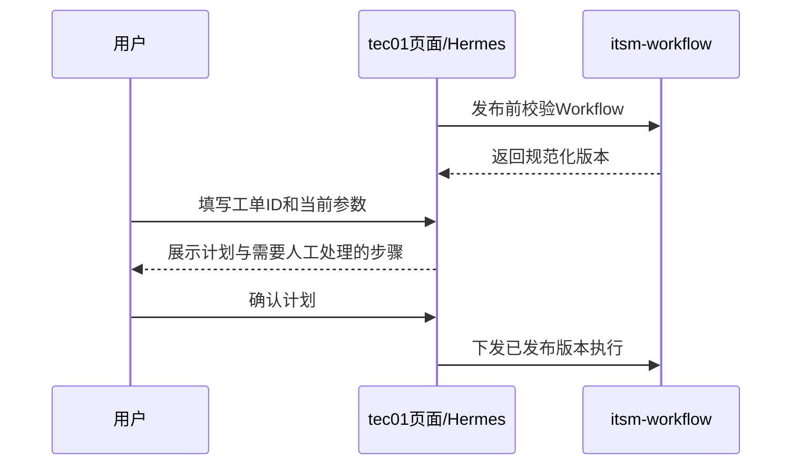
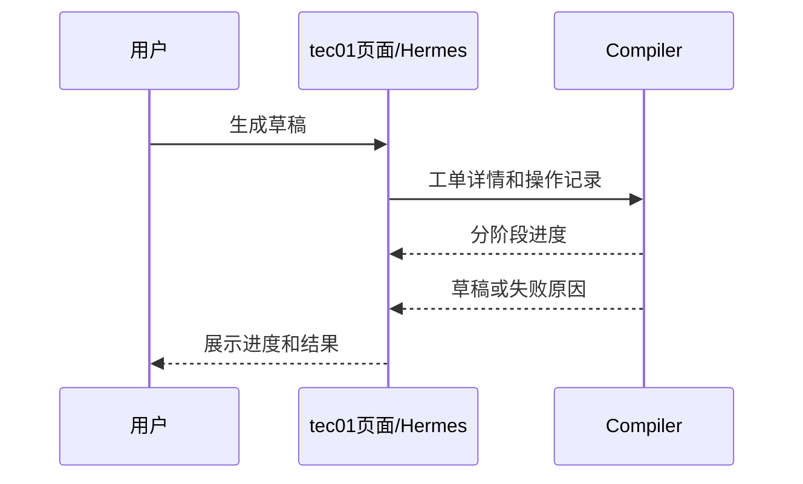
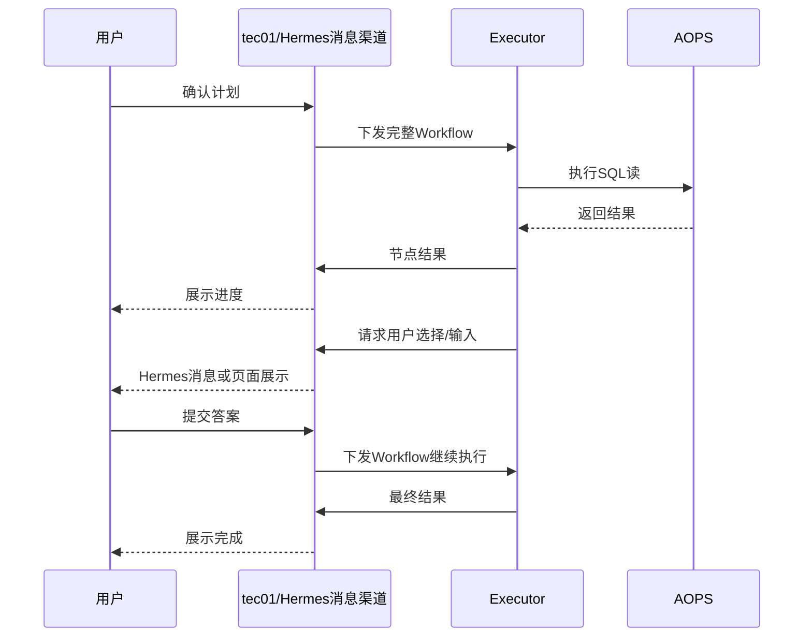

# tec01与itsm-workflow接口约定

本文只保留双方第一版开发需要的接口。tec01主动调用Compiler和Executor；itsm-workflow通过回调返回进度、节点状态和结果。

## 认证和通用规则

- 双方请求使用内网HTTPS和固定服务Token。
- 所有变更请求携带唯一`requestId`，重复请求返回原结果。
- Workflow通过`workflowContentHash`校验，执行期间不能被修改。
- AOPS API Key不出现在Workflow、日志、节点结果或回调中。

## itsm-workflow提供的接口

### Node Catalog

```http
GET /internal/v1/runtime/catalog
```

tec01在编辑和发布Workflow时读取节点类型、配置Schema、输入输出和Handler版本。

### 校验Workflow

```http
POST /internal/v1/runtime/workflows/validate
```

```json
{
  "workflowDefinition": {},
  "validationMode": "PUBLISH"
}
```

tec01在审核发布时必须调用一次。返回规范化Workflow、Catalog摘要和内容哈希；tec01将三者随不可变发布版本保存。草稿编辑时也可调用，用于即时显示配置错误。

### 计划预览接口

```http
POST /internal/v1/runtime/workflows/plan
```

返回节点、连线、运行输入说明和风险提示，供Studio或tec01联调时预览。**tec01创建正式计划时不必调用此接口**：它从已发布、已校验的版本生成展示内容，保存当前工单ID、参数、版本快照及`planHash`，交给Hermes或Web页面展示。

正式计划由tec01负责以下检查：

1. 当前用户有权使用已发布经验，工单ID有效。
2. 运行输入中真正必填的参数已提供且类型正确；`NODE_OUTPUT`及HITL运行时才产生的值无需在此阶段输入。
3. 用户确认时提交的`planHash`与所展示的版本、工单ID、参数和计划内容一致。修改任一项后重新展示。

`workflowContentHash`标识发布版本的Workflow定义；`planHash`标识这次运行向用户展示的计划，至少覆盖版本ID及内容哈希、工单ID、已提供的运行参数和展示的节点/连线。两者不能混用。计划卡片要展示条件分支和后续HITL步骤，但不展示尚未执行出来的候选和值。

SQL只读性、节点配置、图是否有环、条件默认边、HITL字段和前置输出绑定由itsm-workflow在**发布前**校验。tec01不维护第二套SQL或DAG校验器。下发执行时Executor再次核对快照内容哈希；Handler版本兼容检查应在联调验收中补齐。

上游结果的具体字段值尚不存在时，静态校验只保证绑定指向上游节点且JSON Pointer格式有效；运行时如果实际结果缺少该字段，Executor返回节点失败原因，tec01展示给用户。

这一分工参考`codex/list-pagination-search`：发布时校验并固化版本；创建计划时从发布版本生成快照、初始化节点状态并保存确认哈希。拆分后把原先本地数据库中的计划和确认事实交给tec01。

tec01可以用同步缓存的Node Catalog检查当前Runtime是否仍支持该发布版本，无需每次计划创建都发起HTTP校验。当前代码对历史Catalog/Handler版本的兼容处理尚未完整实现；双方联调须覆盖“发布后Runtime升级，再创建计划或恢复旧运行”的场景。



### 提交草稿提取任务

```http
POST /internal/v1/compiler/jobs
```

```json
{
  "jobId": "extract_xxx",
  "ticketId": 100173,
  "ticketInfo": {},
  "auditTimeline": []
}
```

响应：

```http
202 Accepted
```

Compiler在后台处理，并通过tec01回调接口报告进度和最终结果。

### 下发完整Workflow

```http
POST /internal/v1/executions/dispatch
```

```json
{
  "dispatchId": "dispatch_xxx",
  "runId": "run_xxx",
  "ticketId": 100173,
  "workflowContentHash": "sha256...",
  "workflowSnapshot": {},
  "runInputs": {},
  "nodeStates": {
    "sql-1": "SUCCEEDED",
    "sql-2": "READY"
  },
  "outputRefs": {
    "sql-1": "artifact_sql_1"
  },
  "nodeOutputs": {
    "sql-1": {"status":0,"rowCount":2,"data":[]}
  },
  "resumePayload": null
}
```

Executor返回：

```json
{
  "dispatchId": "dispatch_xxx",
  "accepted": true,
  "executorId": "executor-01"
}
```

响应只表示已经接受。真实进度以节点回调为准。

容量不足时返回：

```http
429 Too Many Requests
Retry-After: 3
```

tec01保持运行排队并稍后重试。

### 暂停和取消

```http
POST /internal/v1/executions/{runId}/commands
```

暂停：

```json
{"commandId":"cmd_xxx","type":"PAUSE"}
```

取消：

```json
{"commandId":"cmd_xxx","type":"CANCEL"}
```

Executor先返回已接收，再在安全处理完成后通过运行回调返回`PAUSED`、`CANCELLED`或`UNKNOWN`。

## tec01提供的回调接口

### 提取进度

```http
POST /internal/v1/compiler/jobs/{jobId}/progress
```

```json
{
  "stage": "FILTERING_OPERATIONS",
  "message": "正在过滤有效SQL",
  "current": 3,
  "total": 8
}
```

### 提取完成或失败

```text
POST /internal/v1/compiler/jobs/{jobId}/complete
POST /internal/v1/compiler/jobs/{jobId}/fail
```

完成响应包含`DraftProposal`和过滤诊断；失败响应包含错误码和可读原因。

### 节点开始

```http
POST /internal/v1/runs/{runId}/nodes/{nodeId}/started
```

```json
{
  "dispatchId": "dispatch_xxx",
  "attemptId": "attempt_xxx",
  "startedAt": "2026-09-21T14:20:00+08:00"
}
```

### 节点完成、失败或等待

```http
POST /internal/v1/runs/{runId}/nodes/{nodeId}/completed
```

```json
{
  "dispatchId": "dispatch_xxx",
  "attemptId": "attempt_xxx",
  "status": "SUCCEEDED",
  "safeSummary": "查询返回2行",
  "result": {},
  "selectedEdgeId": "edge-next",
  "skippedNodeIds": []
}
```

`status`可以是：

```text
SUCCEEDED
FAILED
WAITING_INPUT
PAUSED
CANCELLED
UNKNOWN
```

第一版节点结果直接放在回调`result`中，沿用SQL读20 MiB上限；tec01收到后负责持久化。

### 运行结束和释放

```http
POST /internal/v1/runs/{runId}/released
```

```json
{
  "dispatchId": "dispatch_xxx",
  "status": "FAILED",
  "currentNodeId": "sql-2",
  "reason": "节点执行失败"
}
```

WAITING、PAUSED、FAILED、CANCELLED、UNKNOWN和SUCCEEDED都会释放Executor中的运行上下文。

## HITL接口

HITL由Executor创建，tec01保存并通过Hermes消息渠道或页面交给用户。

### 打开人工交互

节点完成回调使用`WAITING_INPUT`并携带：

```json
{
  "interaction": {
    "interactionId": "interaction_xxx",
    "kind": "HITL_SELECT",
    "title": "请选择客户",
    "displayFields": ["customer_name", "customer_id", "status"],
    "candidateArtifactId": "artifact_candidates"
  }
}
```

自由输入使用`HITL_FORM`和字段Schema。

### 用户查询候选和提交

```text
GET  /api/v1/runs/{runId}/interactions/{interactionId}/options
POST /api/v1/runs/{runId}/interactions/{interactionId}/reply
```

Hermes MCP调用同一组tec01接口。选择时只提交`candidateId`；自由表单提交`values`。

提交成功后tec01重新调用`/internal/v1/executions/dispatch`，传入相同Workflow、最新节点状态和`resumePayload`。

## 面向Hermes的MCP工具

tec01提供：

```text
workflow_match
workflow_plan
workflow_approve
workflow_status
workflow_wait
workflow_interaction_options
workflow_interaction_reply
workflow_pause
workflow_resume
workflow_cancel
workflow_retry
```

Hermes必须：

- 在执行前展示完整计划并取得用户确认。
- 收到HITL时展示候选或字段，不自行猜测用户答案。
- 多字段填写完成后汇总并让用户确认。
- 持续把tec01返回的节点状态和失败原因告诉用户。
- 用户从页面完成操作后，Hermes读取同一运行状态继续反馈。

## 简洁泳道图

### 提取



### 执行和HITL



## 最小联调顺序

1. 发布前Workflow校验；tec01独立创建计划并向用户展示。
2. tec01下发两步SQL Workflow，确认逐节点状态返回。
3. 条件节点根据`rowCount`选择分支。
4. `hitl_select`通过Hermes和页面完成选择。
5. `hitl_form`提交多个参数并绑定到下游SQL。
6. 暂停、取消、失败和重试。
7. Compiler进度在页面和Hermes中同步展示。
