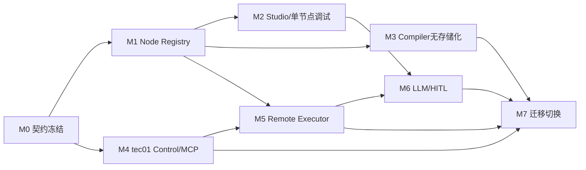

# tec01控制面与itsm-workflow运行时详细实施计划

## 目标

将当前单体系统演进为：

```text
tec01
  AOPS Channel
  Hermes MCP
  production knowledge/run/event/artifact/checkpoint storage
  production state machine and policy

itsm-workflow
  Node Registry
  Workflow Compiler
  Plan Builder
  Python Executor
  Studio UI/API
  temporary TEST_ONLY SQLite
```

生产状态全部在tec01，itsm-workflow不持有生产业务数据库；Studio SQLite只保存临时测试数据。

## 非目标

- 不实现第二套语言Executor。
- 不允许运行期上传任意Python节点代码。
- 不支持通用无限循环；第一版只支持受控LLM/HITL refinement。
- 不允许Studio单节点调试修改tec01生产运行。
- 不把生产数据或Token保存到localStorage。
- 不迁移正在运行或等待中的旧checkpoint。

## 目标代码结构

在保持现有服务可运行的前提下逐步形成：

```text
app/
  runtime/
    contracts/
      workflow.py
      node.py
      execution.py
      errors.py
    registry/
      registry.py
      loader.py
      compatibility.py
    nodes/
      sql_read/
      condition/
      llm_extract/
      hitl_select/
      human_input/
      approval/
      end/
    ports/
      state.py
      artifact.py
      checkpoint.py
      credential.py
      model.py
      human.py
      db_read.py
      event.py
    planner/
    executor/
  compiler/
  adapters/
    monolith/
    tec01/
    studio_sqlite/
    simulation/
  studio/
    api/
    storage/
frontend/
  studio/
```

现有`app.main/app.engine/app.extraction`先作为Monolith Adapter继续工作，直到对应新模块通过兼容测试。

## 核心契约

### Workflow Definition v2

```json
{
  "schemaVersion": 2,
  "catalogDigest": "sha256...",
  "entryNodeId": "sql-read",
  "nodes": [
    {
      "id": "sql-read",
      "type": "sql_read",
      "schemaVersion": 1,
      "handlerVersion": "1.0.0",
      "title": "查询候选客户",
      "config": {},
      "inputs": [],
      "approvalPolicy": "PLAN",
      "timeoutSeconds": 600,
      "uiPosition": {"x":100,"y":100}
    }
  ],
  "edges": [
    {"id":"edge-1","kind":"NORMAL","source":"sql-read","target":"llm-extract"},
    {
      "id": "refine-1",
      "kind": "REFINEMENT",
      "source": "hitl-select",
      "target": "llm-extract",
      "maxIterations": 3,
      "feedbackInputName": "user_feedback"
    }
  ]
}
```

`kind`取值为`NORMAL/CONDITION/REFINEMENT`。

v1到v2转换：

- 节点补充Registry解析出的`schemaVersion/handlerVersion`。
- 普通边转`NORMAL`，condition出线转`CONDITION`。
- 不自动生成REFINEMENT边。
- 转换结果重新计算内容哈希并进入待审核，不直接覆盖已发布版本。

### NodeResult

```json
{
  "status": "SUCCEEDED",
  "output": {},
  "safeSummary": "查询返回2行",
  "artifacts": [
    {"localId":"result","contentHash":"sha256...","sensitivity":"BUSINESS_DATA"}
  ],
  "externalRequestId": "optional",
  "metrics": {"durationMs":2310}
}
```

### ExecutionContext

```json
{
  "mode": "PRODUCTION",
  "runId": "run_xxx",
  "nodeId": "sql-read",
  "attemptId": "att_xxx",
  "ticketId": 100173,
  "leaseToken": "opaque",
  "runRevision": 18,
  "runtimeVersion": "1.0.0"
}
```

### 稳定错误码

```text
VALIDATION_FAILED
NODE_TYPE_UNSUPPORTED
NODE_VERSION_UNSUPPORTED
CREDENTIAL_EXPIRED
TIMEOUT
CANCELLED
NON_ZERO_EXIT
EXTERNAL_BUSINESS_ERROR
OUTPUT_LIMIT_EXCEEDED
MODEL_OUTPUT_INVALID
INTERRUPT_REQUIRED
REFINEMENT_LIMIT_REACHED
UNKNOWN_EXTERNAL_RESULT
STATE_REVISION_CONFLICT
LEASE_EXPIRED
```

## tec01内部API

### Node Catalog和计划

itsm-workflow提供：

```text
GET  /internal/v1/runtime/catalog
POST /internal/v1/runtime/workflows/validate
POST /internal/v1/runtime/workflows/plan
POST /internal/v1/compiler/workflow-drafts
```

tec01保存Catalog响应的完整内容和摘要哈希。`plan`请求包含不可变workflow snapshot、ticketId和参数；返回安全计划、requiredRuntimeVersion和plan material hash。

### Executor领取

tec01提供：

```text
POST /internal/v1/execution/claims
POST /internal/v1/execution/claims/{leaseToken}/heartbeat
GET  /internal/v1/execution/claims/{leaseToken}/commands
POST /internal/v1/execution/claims/{leaseToken}/release
```

```json
{
  "executorId": "runtime-t1361-01",
  "runtimeVersion": "1.0.0",
  "supportedCatalogDigests": ["sha256..."],
  "availableSlots": 2
}
```

### Attempt开始

```http
POST /internal/v1/runs/{runId}/attempts
```

```json
{
  "nodeId": "sql-read",
  "handlerVersion": "1.0.0",
  "leaseToken": "opaque",
  "expectedRevision": 18,
  "idempotencyKey": "run:node:attempt-number"
}
```

tec01先提交STARTED再返回`attemptId/revision`，Executor收到后才能调用外部系统。

### STAGED上传

```text
PUT  /internal/v1/runs/{runId}/staged-artifacts/{uploadId}
PUT  /internal/v1/runs/{runId}/staged-checkpoints/{checkpointId}
POST /internal/v1/runs/{runId}/staged-checkpoints/{checkpointId}/writes
```

请求包含内容哈希、格式版本、敏感级别、leaseToken和expiresAt。STAGED对象默认1小时清理，不对用户查询可见。

### Attempt原子提交

```http
POST /internal/v1/runs/{runId}/attempts/{attemptId}/commit
```

```json
{
  "leaseToken": "opaque",
  "expectedRevision": 19,
  "idempotencyKey": "attempt:att_xxx:complete",
  "status": "SUCCEEDED",
  "nodeTransition": {"nodeId":"sql-read","from":"RUNNING","to":"SUCCEEDED"},
  "artifactUploads": [
    {"uploadId":"upl_result","contentHash":"sha256...","role":"NODE_RESULT"}
  ],
  "checkpointId": "cp_xxx",
  "event": {"type":"NODE_SUCCEEDED","safeSummary":"查询返回2行"}
}
```

tec01单事务完成：校验租约/revision/幂等，转正STAGED对象，完成attempt，更新node/run/outputRef，追加事件并递增revision。重复相同请求返回原结果，同幂等键不同哈希返回409。

### Interrupt

```text
POST /internal/v1/runs/{runId}/interrupts
GET  /internal/v1/runs/{runId}/interrupts/{interruptId}/response
```

Executor创建interrupt后，通过attempt commit原子写入等待状态和checkpoint并释放租约。用户回复由tec01 MCP保存，运行重新QUEUED。

## Studio API与临时数据

```text
GET    /studio/api/v1/node-catalog
POST   /studio/api/v1/workspaces
PATCH  /studio/api/v1/workspaces/{id}
POST   /studio/api/v1/extractions
POST   /studio/api/v1/test-runs
GET    /studio/api/v1/test-runs/{id}
POST   /studio/api/v1/node-debug-runs
GET    /studio/api/v1/node-debug-runs/{id}
POST   /studio/api/v1/node-debug-runs/{id}/interrupts/{interruptId}/reply
POST   /studio/api/v1/node-debug-runs/{id}/cancel
POST   /studio/api/v1/drafts/{id}/promote
```

SQLite迁移单独放在`studio/migrations`，不复用生产Alembic链。

临时表：

```text
studio_workspaces
studio_drafts
studio_extraction_jobs
studio_test_runs
studio_test_node_states
studio_test_attempts
studio_test_events
studio_test_artifacts
studio_test_interrupts
studio_node_debug_runs
```

所有表包含`workspace_id/test_only/expires_at/created_by`。默认TTL 24小时，清理任务每10分钟执行；单artifact默认10 MiB、单workspace 100 MiB、SQLite总量5 GiB，均可配置。

## 分阶段实施

阶段依赖：



### 阶段0：冻结契约和决策记录

交付：

- OpenAPI/JSON Schema和ADR。
- tec01与itsm-workflow共同维护的错误码、状态机和幂等规则。
- 契约测试Harness，双方CI均执行。

验收：Mock tec01完成claim → attempt start → staged upload → commit；revision冲突、租约过期和重复提交测试通过。未冻结契约前不删除现有数据库代码。

### 阶段1：Node Registry基础

1. 建立Manifest、Registry、兼容矩阵和Handler协议。
2. 建立Port接口和ExecutionContext/NodeResult。
3. 迁移`sql_read/condition/human_input/approval/end`到节点包。
4. 实现WorkflowDefinition v2和v1转换器。
5. 后端workflow校验改为Registry驱动。
6. 前端节点列表和通用表单改为Catalog/UI Schema驱动。
7. 保留受控Renderer扩展点，禁止远程JavaScript。

兼容：Monolith Adapter把Port调用转回现有SQLAlchemy、SecretBox、CLI和event实现，现有API/Worker行为保持不变。

验收：新增一个无外部调用节点不修改调度核心和通用编辑器；v1知识转换后计划与SQL等价。

### 阶段2：Studio与单节点调试

1. 建立独立Studio SQLite和迁移。
2. 建立workspace、临时DAG、test run和artifact模型。
3. 实现Simulation/Test Adapters。
4. 实现单节点调试API和UI。
5. 支持MANUAL_VALUE/FIXTURE/TEST_ARTIFACT/REDACTED_SNAPSHOT输入。
6. 加入TTL、容量和敏感字段扫描。

验收：现有节点可独立调试；删除SQLite不影响生产；localStorage扫描不到禁用字段和值。

### 阶段3：Compiler无存储化

1. 将审计解析、过滤、去重和参数化提取为纯模块。
2. `_assess`改为ModelPort。
3. 输入改为`ticketInfo + auditTimeline + targetCatalogVersion`。
4. 输出DraftProposal和diagnostics，不写Knowledge。
5. Studio接入Compiler调试。
6. tec01实现extraction job、证据获取、幂等和DRAFT保存。

验收：黄金工单样本语义等价；LLM失败、无有效SQL、result失败和Schema错误不创建草稿。

### 阶段4：tec01 MCP和生产控制面

tec01实现兼容MCP工具、生产数据模型、revision CAS、wait/通知、Credential Broker和Node Catalog。itsm-workflow提供catalog/validate/plan/compiler API和契约Mock。Python MCP进入只读兼容期，不再创建新运行。

验收：Hermes不修改业务Prompt即可通过tec01完成匹配、计划、确认和状态查询。

### 阶段5：Remote State Executor

1. 实现Tec01 State/Artifact/Credential/Event/Human Ports。
2. 实现claim、租约心跳和commands。
3. 实现Remote Checkpointer STAGED写入。
4. Engine移除AsyncSession依赖。
5. attempt start先于外部调用。
6. 节点结束使用原子attempt commit。
7. 注入网络超时、重复响应和revision冲突处理。

运行模式：`RUNTIME_BACKEND=MONOLITH|TEC01`。不进行生产双写，只影子比较validate/plan；切换后只有新运行进入TEC01 backend。

验收：删除生产DATABASE_URL后仍可执行；CLI期间杀死Executor进入UNKNOWN且不自动重放；租约过期后旧Executor停止写入。

### 阶段6：LLM与HITL节点

实现`llm_extract`的ModelPort、输入投影、Schema、幂等结果和审计。实现`hitl_select`的SELECT/MANUAL_VALUE/CANCEL、持久化interrupt和单候选自动选择。

实现REFINEMENT：

- WorkflowEdge `REFINEMENT`。
- 受控回边校验。
- interactionSession、feedback history和最大次数。
- REFINE每轮独立LLM/HITL attempt和artifact。

验收：SQL多行→LLM候选→单选自动通过；多候选可选择、补充条件重试、直接输入或取消；重启不丢中断历史；超限后REFINE被拒绝。

### 阶段7：数据迁移和切换

1. 通过DAG v2导入导出迁移知识和版本。
2. 不迁移活跃运行，等待旧`RUNNING/WAITING/UNKNOWN`清零。
3. tec01 MCP切为正式入口，新运行进入tec01。
4. 旧运行保持原系统只读。
5. 观察期后下线Python MCP和生产业务API，保留Compiler、Executor、Studio和内部Runtime API。

回滚时停止tec01创建新运行并切回旧MCP。已开始的tec01运行继续完成或人工处理，禁止复制到旧系统重放。

## 测试计划

### Registry与Handler

- Manifest重复、缺失、非法版本和哈希不一致。
- v1→v2转换、Catalog快照和兼容矩阵。
- 每节点`validate/plan/execute/resume/cancel/reconcile/summarize`。
- PRODUCTION/TEST/SIMULATION/DRY_RUN支持矩阵。

### 状态一致性与故障注入

- 租约、revision、幂等和重复commit。
- STAGED上传后commit失败的TTL清理。
- checkpoint未激活时恢复忽略。
- 在STARTED前、CLI期间、上传后和commit响应前杀死Executor。
- tec01重启、网络分区、多Executor竞争和凭据过期。

### Studio

- 单节点输入来源、Schema和debugPolicy。
- SQLite TTL、容量和并发写。
- 生产artifact脱敏复制和权限。
- localStorage敏感字段扫描。

### LLM/HITL

- 无效JSON、Schema错误、模型超时和重复响应。
- 0/1/多候选。
- SELECT/REFINE/MANUAL_VALUE/CANCEL。
- 多轮反馈、迭代上限、重复回复和旧interrupt回复。

### 端到端

- Channel请求→匹配→计划→确认→SQL→LLM→HITL→下游→结果。
- 用户暂停、继续、取消和重试。
- MCP wait游标、主动通知去重和结果分页。

## 发布与观测

新增指标：

```text
runtime_claim_latency
runtime_active_leases
runtime_lease_conflicts
runtime_attempt_commit_latency
runtime_revision_conflicts
runtime_staged_artifacts
runtime_checkpoint_latency
runtime_node_duration{type,mode,status}
runtime_interrupt_waiting{type}
runtime_refinement_iterations
studio_sqlite_size_bytes
studio_expired_records
```

日志包含`runId/nodeId/attemptId/leaseId/revision/idempotencyKeyHash`，不得包含Token、完整SQL结果、模型敏感输入或用户手工值。

## 里程碑

| 里程碑 | 可交付结果 |
|---|---|
| M1 Registry | 现有节点Registry驱动，Monolith行为不变 |
| M2 Studio | SQLite临时编排、全流程测试和单节点调试 |
| M3 Compiler | 无存储DraftProposal接口，tec01可创建DRAFT |
| M4 tec01 Control/MCP | Hermes通过tec01完成计划前流程 |
| M5 Remote Executor | 新运行全程只在tec01持久化 |
| M6 LLM/HITL | 多候选迭代选择端到端通过 |
| M7 Cutover | 新入口稳定，旧运行排空，具备回滚预案 |

## 实施原则

- 每阶段可独立发布和回滚。
- 先建立抽象再切换存储，不在同一提交中同时重写Registry、Engine和tec01协议。
- 先影子校验计划，再迁移真实执行，不对生产外部操作做双执行。
- 任何生产状态变化以tec01事务提交为准。
- 新节点通过统一契约和故障测试，不修改调度核心。

## 实施假设

- tec01由独立Java团队并行实施，能够提供内部OpenAPI、数据库事务和Channel/MCP改造。
- AOPS允许tec01托管用户API Key或签发等价短期凭据；若无法提供Credential Broker，生产凭据迁移暂停。
- itsm-workflow生产Executor保持单一Python实现，不规划第二套语言运行时。
- 第一版Studio为单实例SQLite；多实例需求出现后才迁移独立测试数据库。
- 第一版REFINEMENT只支持`llm_extract ↔ hitl_select`受控模式。
- 迁移期间不搬运活跃checkpoint，旧运行由旧系统完成或人工终止。
